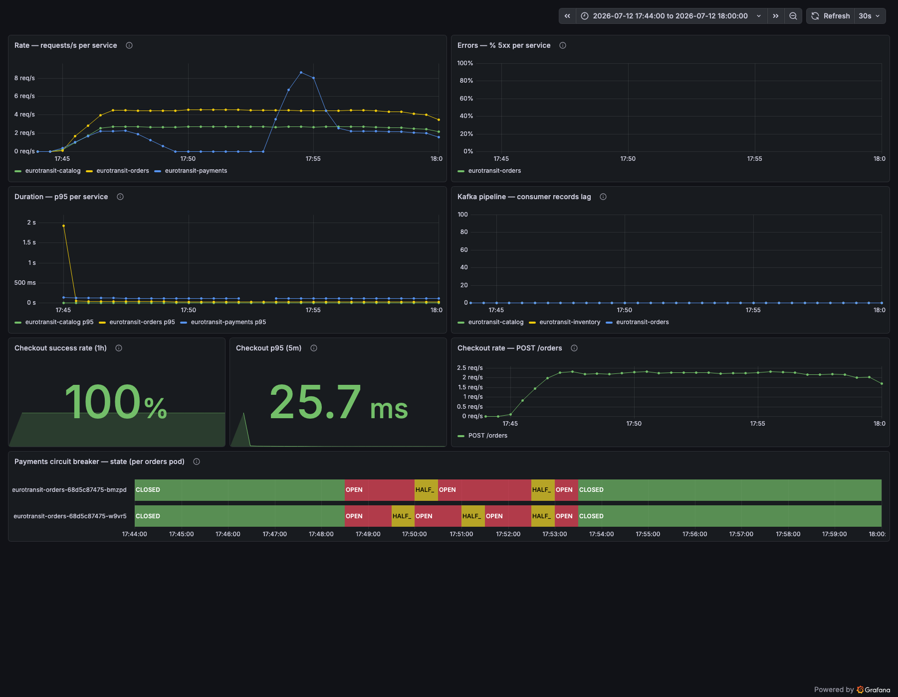
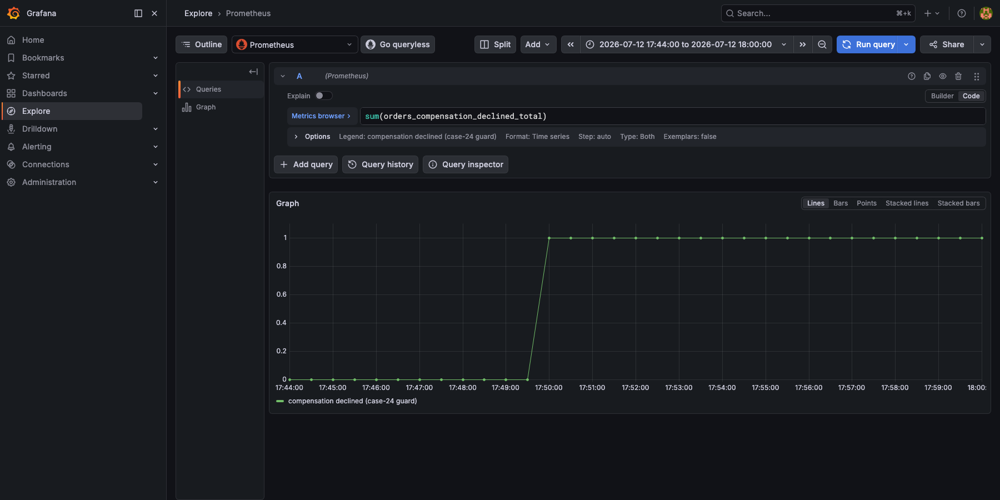

# CE-1 / Run 4 — Verification re-run after the case-24 fix (2026-07-12, 15:47 UTC)

*Execution record for [`ce-1-latency-payments.md`](ce-1-latency-payments.md), re-run
against the compensation-guard fix (app #28, orders `70d3bfd`). Purpose: close the
case-24 loop — the run-3 finding (an exhausted redelivery compensating an order that had
reached CONFIRMED, releasing a confirmed order's seats) was fixed and must be **proven
fixed under the same chaos that found it**. Same manifest, same load shape, plus the
four new acceptance checks from the review thread.*

## Setup

| | |
|---|---|
| Date / operator | 2026-07-12 / @giova95 (Claude driving harness + kubectl, per session authorization; ADR 0019 gate on this record) |
| Code under test | orders `70d3bfd` — first deploy of the case-24 guard (`OrderFailureRecoverer`, `orders_compensation_declined_total`) |
| Injection | final manifest (payments egress → orders pods, 3 s ± 500 ms, 5 m) — unchanged from run 3 |
| Load | k6 `baseline.js`, 3 VUs, 15 m (checkout ≈ 2.2/s + browse ≈ 2.7/s) |
| Pre-run | stale run-3 chaos object cleaned; demo route reseeded to 5 000 (operator seed — was 1 448); breakers CLOSED; guard counter present at 0 |
| T0 (AllInjected) | **15:47:39 UTC**; fault verified live in-pod: orders→payments via Service **5.45 s** (0.00 s after expiry) — the mandatory bite check |

## Steady state (Prometheus, pre-inject 15:47:05)

Checkout 2.25 req/s, server-side p95 **37.9 ms**; catalog 2.70 req/s, p95 **0.96 ms**;
both breakers CLOSED; `not_permitted` = 0; `orders_compensation_declined_total` = 0;
`Redelivery exhausted` log lines since deploy = 0.

## Window timeline (samples)

| ts (UTC) | breaker (per orders pod) | not_permitted (cum.) | checkout p95 (ms) | catalog p95 (ms) |
|---|---|---|---|---|
| 15:48:15 | **open \| open** (≤ 36 s after T0) | 7 | 33.2 | 0.96 |
| 15:49:26 | half_open \| open (probe → snapped back) | 24 | 27.5 | 0.95 |
| 15:50:38 | open \| open | 43 | 27.2 | 0.95 |
| 15:51:49 | open \| open | 63 | 26.5 | 0.96 |
| 15:52:39 | *fault expires* | | | |
| 15:54:14 | **closed \| closed**; in-pod timing 0.00 s | | | |

Same lifecycle as run 3: fast open, half-open probes hitting the live fault, bounded
fast-fail (checkout p95 never left ~27–33 ms), catalog flat — containment held again.

## Convergence (orders DB, window cohort 15:47:39–15:52:39)

- **675 orders**: **673 CONFIRMED + 2 FAILED (0.30 %), 0 non-terminal.**
- Confirmed-in: median **195.4 s** / p95 318.1 s / max 348.5 s — backlog fully drained
  within ~2 minutes of the breakers closing. Same queued-drain signature as run 3.

## The four new acceptance checks (the point of this run)

1. **Exhaustions reconcile exactly — the run-3 discrepancy is gone.** 3 exhausted
   records, every one accounted for:

   | order | outcome | reservation |
   |---|---|---|
   | `41e3be08…` | FAILED (bounded retries exhausted) | **RELEASED** ✓ designed path |
   | `b28dadf9…` | FAILED (bounded retries exhausted) | **RELEASED** ✓ designed path |
   | `3128d211…` | **CONFIRMED** (competing success mid-fault) | **RESERVED — untouched** ✓ **guard fired** |

2. **Zero CONFIRMED + RELEASED triples**: every RELEASED reservation in the window
   belongs to a FAILED order. The run-3 failure mode did not recur.
3. **The guard is observable**: `orders_compensation_declined_total` = **1**, and exactly
   one `case 24 guard` log line, naming order `3128d211…`. Note: the race **reproduced on
   the very first re-run** — the guard is load-bearing, not theoretical.
4. **Client-side p95 clean this time**: place_order **193.0 ms** ✅ / browse_catalog
   158.3 ms ✅ (0 failed of 6 347, 0 × 429, all thresholds green; max 2.15 s = the
   breaker-opening transient, bounded by the 2 s call timeout). The runs-2/3 client-side
   inflation did not reproduce on a different day/window — consistent with the WAN/TLS
   variance attribution. *(Gateway-side p95 could not be captured: Traefik metrics are
   not currently scraped by Prometheus — noted as a small observability follow-up.)*

## Dashboard captures

Native Grafana, run-4 window. *(Grafana renders in CEST = UTC+2: the breaker OPEN band
starts ~17:48 on the panel = 15:48 UTC = T0+~30 s; all prose times here are UTC.)*

**RED money-path** — [`ce1-run4-red-money-path.png`](ce-1-images/ce1-run4-red-money-path.png):

The breaker state-timeline (bottom) shows both orders pods CLOSED → OPEN → HALF_OPEN
cycling → CLOSED after expiry; **Errors % 5xx flat at 0**, **Checkout success (1h)
100 %**, **Checkout p95 (5m) 25.7 ms**, Kafka consumer lag ≈ 0. The payments `rate` line
collapses during the fault while orders/catalog hold — containment.

**Case-24 guard firing** — [`ce1-run4-case24-guard-explore.png`](ce-1-images/ce1-run4-case24-guard-explore.png):

Grafana Explore on `sum(orders_compensation_declined_total)` over the run-4 window: the
counter steps **0 → 1 at ~17:49:30 CEST** — the exact moment the guard declined to
compensate the one order that had reached CONFIRMED. This is the fix working, on a
dashboard, under the same fault that exposed the bug.

**USE infrastructure** — [`ce1-run4-use-infrastructure.png`](ce-1-images/ce1-run4-use-infrastructure.png):
payments CPU/restarts flat, ready-replicas steady (no cascade).

*(All captured live from the cluster's Grafana against its own Prometheus on the PVC.
The pre-T0 blip in the checkout p95 panel is the rate-window warm-up at load start, seen
on every run.)*

## Outcome

| Date | Operator | Load | Breaker opened | Fallbacks | Catalog impact | Recovery | Exhausted / FAILED / guarded | Double charges | Outcome |
|------|----------|------|----------------|-----------|----------------|----------|------------------------------|----------------|---------|
| 2026-07-12 | @giova95 | 2.2 + 2.7 rps, 15 m | ≤ T0+36 s | 63+ not-permitted | none (p95 0.95 ms flat) | closed ≤ 95 s after expiry | **3 / 2 / 1 — fully reconciled** | 0 | **PASS — case-24 finding CLOSED** |

## Conclusion

> **Draft — pending team ratification (ADR 0019).**

The loop is closed: the defect found by run 3 (exhaustion compensating a CONFIRMED
order) **reproduced under the same fault on the first verification run and was blocked
by the guard** — the confirmed order kept its seats (`RESERVED`), the two genuine
failures were compensated as designed, and the accounting reconciles exactly
(3 exhausted = 2 FAILED + 1 declined, vs run 3's unexplained 3-vs-2). Found under
chaos → fixed (#28) → proven under the same chaos. The
`orders_compensation_declined_total` counter turned the guard into a dashboard-visible
signal on its first day in production.
