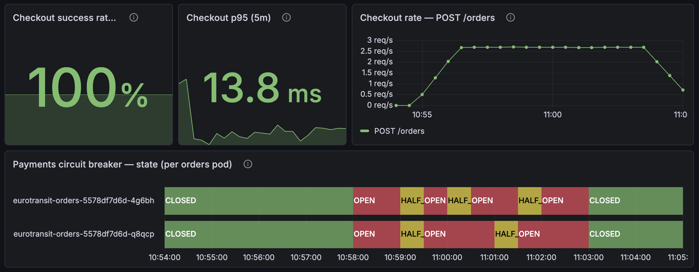
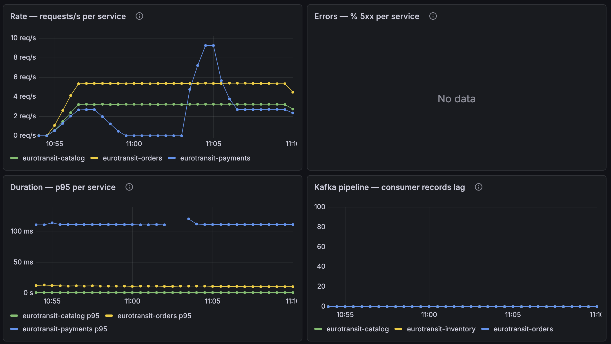

# CE-1 / Run 5 — Reviewer reproduction on a pristine seed (2026-07-13, 08:57 UTC)

*Execution record for [`ce-1-latency-payments.md`](ce-1-latency-payments.md). Purpose:
**independent reviewer reproduction** (ADR 0019) of the run-3/run-4 result — same final
manifest, same load shape, but on a **fully wiped and reseeded database state**
(`just seed-db ce-1`), which upgrades the verification from time-windowed cohorts to
**exact whole-database reconciliation** against the k6 client-side count. **PASS** —
and the case-24 race reproduced for the third time and was blocked by the guard again.*

## Setup

| | |
|---|---|
| Date / operator | 2026-07-13 / @vojtech-n as reviewer (Claude assisting with evidence gathering + doc; ADR 0019 gate on this record) |
| Code under test | current `main` deploy, image tags `786f302` (includes the case-24 guard, app #28) |
| Injection | final manifest (payments egress → orders pods, 3 s ± 500 ms, 5 m) — unchanged from runs 3/4 |
| Load | k6 `baseline.js`, 3 VUs, 15 m (2415 iterations ≈ 2.7 orders/s + browse) |
| Seed | `just seed-db ce-1`: **full wipe of all four DBs**, route `…0001` at 5000/5000 — no cohort filtering needed anywhere below |
| T0 (AllInjected) | **08:57:25 UTC**, both payments pods injected; expiry 09:02:25 |
| Bite check | in-pod orders→payments via Service: **5867 ms under the fault** → 102 ms → **9 ms after expiry**. *(Tooling note: the orders image is busybox-based — no `curl`; check done with a timed `busybox wget`, command in the appendix.)* |

## Timeline and observations

- **Breaker**: both orders pods CLOSED → **OPEN ≤ T0+35 s** (panel band at ~10:58 CEST),
  then OPEN ↔ HALF_OPEN cycling for the whole window — every half-open probe hit the
  live fault and snapped back — CLOSED again within ~1 minute of expiry. Same lifecycle
  as runs 3/4.
- **Fallbacks**: ~**84** not-permitted calls over the window (Prometheus `increase`) —
  matching run 3's 84.
- **No unbounded hang**: checkout p95 (5 m) stayed **12.5–13.9 ms** on the dashboard for
  the entire run; k6 client-side `place_order` p95 **52.1 ms**, max 245 ms — no trace of
  the 3 s injected delay reaching users.
- **Containment**: catalog rate and p95 flat throughout; `Errors — % 5xx`: **No data**
  (zero server errors). Payments pods: CPU/memory/throttling flat, **0 container
  restarts, ready replicas steady** — no probe-kill cascade (run-1 regression absent).
- **Guard counter**: `sum(orders_compensation_declined_total)` = **0 at 08:55 → 1 at
  09:05** (orders pods restarted 06:25 UTC, so the counter was fresh — the step is
  unambiguously this run's).
- **Queued drain**: visible on the RED rate panel as the payments call-rate spike
  (~9 req/s) right after the breakers closed — the parked backlog authorizing.
- **Client-side p95 clean again** (place_order 52 ms / catalog 38 ms, all thresholds
  green, 0 failed of 7728, 0 × 429): the runs-2/3 client-side inflation did not
  reproduce, further consistent with the WAN/TLS-variance attribution.

## Verification (exact reconciliation — pristine seed, whole-DB counts)

| Check | Result |
|---|---|
| **Client count = DB terminal count** | ✅ k6 **2415** = **2413 CONFIRMED + 2 FAILED**, 0 non-terminal |
| **Exhaustion accounting (case-24 regression check)** | ✅ **3 exhausted = 2 FAILED + 1 guarded**, fully reconciled (below) |
| **Zero CONFIRMED-order-with-RELEASED-reservation pairs** | ✅ the **only two** RELEASED reservations in the DB belong to the two FAILED orders |
| **Guard observable** | ✅ counter delta exactly **1**; one `case 24 guard` log line naming the order |
| **No double charge** | ✅ 2413 payment intents, 0 orders with > 1 intent |
| **Seats reconcile (I2)** | ✅ 5000 − 2587 available = 2413 = RESERVED reservations |
| **Dedup clean** | ✅ inventory `processed_events` = 2417 = 2415 `order-placed` + 2 `order-failed` |
| **Notifications** | ✅ 2413 SENT = one per confirmed order |

The three exhausted redeliveries (all `inventory-reserved`, orders pod `…-4g6bh`):

| Order | Log ts (UTC) | Outcome | Reservation |
|---|---|---|---|
| `ee488131…` | 08:59:15 | **CONFIRMED** (competing success mid-fault) | **RESERVED — untouched** ✓ **guard fired** |
| `78055242…` | 09:00:46 | FAILED (bounded retries exhausted) | RELEASED ✓ designed path |
| `eb228bdc…` | 09:02:19 | FAILED (bounded retries exhausted) | RELEASED ✓ designed path |

## Dashboard captures

Native Grafana, run-5 window. *(Panels render in CEST = UTC+2: T0 08:57:25 UTC appears
at ~10:57 on the panels; prose times here are UTC.)*

**Steady state, pre-fault** — [`ce1-run5-red-money-path-2.png`](ce-1-images/ce1-run5-red-money-path-2.png):
breakers CLOSED, checkout success 100 %, p95 13.9 ms.

**Full breaker lifecycle** — [`ce1-run5-red-money-path-8.png`](ce-1-images/ce1-run5-red-money-path-8.png):

Both orders pods CLOSED → OPEN (~10:58 CEST = T0+35 s) → HALF_OPEN/OPEN cycling →
CLOSED after expiry; checkout success 100 %, p95 13.8 ms throughout.

**Containment + queued drain** — [`ce1-run5-red-money-path-9.png`](ce-1-images/ce1-run5-red-money-path-9.png):

Per-service RED across the run: the payments call rate collapses during the fault while
orders/catalog hold flat (containment), then spikes to ~9 req/s right after the breakers
close — the parked backlog draining. Errors: No data; consumer lag ≈ 0.

**USE infrastructure** — [`ce1-run5-use-infrastructure-1.png`](ce-1-images/ce1-run5-use-infrastructure-1.png),
[`ce1-run5-use-infrastructure-2.png`](ce-1-images/ce1-run5-use-infrastructure-2.png):
CPU/memory/throttling flat, **0 container restarts**, ready replicas steady — no
probe-kill cascade.

*(Additional interval captures of the same panels: `ce1-run5-red-money-path-{1,3,4,5,6,7,10}.png`.)*

## Review findings (made while preparing this run)

1. **Consumer-lag observability gap (new):** the notifications service exposes **no
   `kafka_consumer_*` metrics** although its `notifications-group` (consuming
   `order-confirmed`) is live on the broker and the pod is scraped. The lag panel and
   the `KafkaConsumerLagHigh` alert are therefore blind to the one consumer whose lag
   is the key degradation symptom. Likely an app-repo Micrometer-binding issue —
   follow-up filed against the app repo. Related limitation to record: client-side lag
   gauges disappear when a consumer dies, so `KafkaConsumerLagHigh` cannot fire for a
   fully-down consumer — the scrape-down alerts must cover that case.
   *(Payments' absence from lag metrics is correct by design: it has no Kafka consumer
   — Orders→Payments is synchronous, ADR 0018.)*
2. **Doc nits in the run-3 record** (main doc): the results-table/observation times
   labelled UTC are actually CEST (the dashboard note's 13:59 UTC conversion is the
   correct one), and "544" vs "2/546" mixes drained-vs-total cohort counts. Both
   corrected in the main doc in this PR (with a correction note at the site).

## Outcome

| Date | Operator | Load | Breaker opened | Fallbacks | Catalog impact | Recovery | Exhausted / FAILED / guarded | Double charges | Outcome |
|------|----------|------|----------------|-----------|----------------|----------|------------------------------|----------------|---------|
| 2026-07-13 | @vojtech-n (reviewer) | 2.7 + 2.7 rps, 15 m, pristine seed | ≤ T0+35 s | ~84 not-permitted | none (flat) | CLOSED ≤ ~60 s after expiry; bite check 9 ms | **3 / 2 / 1 — fully reconciled** | 0 | **PASS — run-4 result independently reproduced** |

## Conclusion

> **Draft — pending team ratification (ADR 0019).**

The run-4 result reproduces independently, on a different day, a different operator,
and a pristine database state: breaker lifecycle, bounded fast-fail, containment, and
queued-drain convergence all match, and the exact whole-DB reconciliation (2415 = 2415)
closes the "nothing lost" claim without cohort caveats. Notably, the case-24 race has
now reproduced on **every run since it was discovered** (runs 3, 4, 5) — it is a
regular companion of this fault, not a rare event — and the guard blocked it each time
with the counter stepping exactly once per occurrence. CE-1's result should be
considered stable and reproducible.
