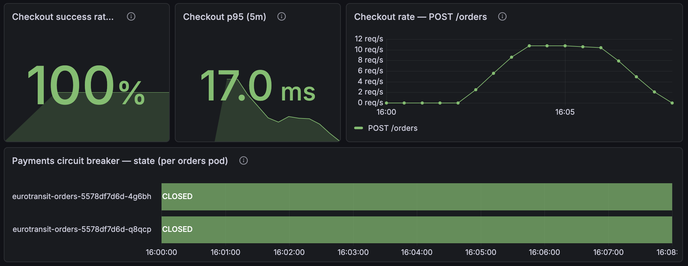

# CE-2 / Run 3 — Reviewer reproduction on a pristine seed (2026-07-13, 14:02 UTC)

*Execution record for [`ce-2-pod-kill-inventory.md`](ce-2-pod-kill-inventory.md).
Purpose: **independent reviewer reproduction** (ADR 0019) of run 2's authoritative
mid-reservation result — same injection, same load shape, but on a **fully wiped and
reseeded state** (`SEATS=500 just seed-db ce-2`), upgrading the verification from
time-windowed cohorts to **exact whole-database reconciliation** against the k6
client-side count. **PASS.***

## Setup

| | |
|---|---|
| Date / operator | 2026-07-13 / @vojtech-n as reviewer (Claude assisting with evidence gathering + doc; ADR 0019 gate on this record) |
| Injection | `PodChaos` `pod-kill`, `mode: one`, `gracePeriod: 0` (SIGKILL) — unchanged from runs 1–2 |
| Seed | `SEATS=500 just seed-db ce-2`: full wipe of all four DBs, contention route `…00ce` at 500/500 |
| Load | k6 `baseline.js`, 12 VUs, 4 m, `ROUTE_ID=…00ce` (2537 iterations ≈ 10.5 orders/s) |
| T0_kill | **14:02:26 UTC** — **224 seats free**, reservations actively in flight |
| Killed pod | `eurotransit-inventory-766689b45b-49h9l` (picked by Chaos Mesh, PodChaos record) |
| Replacement | `…-2wmtz` — Scheduled/Started ~1 s after the `Killing` event, **Ready in ~21 s** |

## The mid-reservation proof

A 1 s watcher on `available_seats` (full log: operator's `ce2-run3-availability.log`)
shows selling started 14:02:00 and the SIGKILL landed 26 s in, mid-slope:

```
14:02:24|248   14:02:25|236   14:02:26|224   ← kill (PodChaos apply 14:02:26Z)
14:02:27|212   14:02:28|200   14:02:29|197   14:02:30|184 ...
14:02:47|3     14:02:48|0     (sold out; 0 thereafter — never negative)
```

Seats kept falling **through the crash** with no stall and no wrong value — the
surviving pod kept reserving while Kafka rebalanced the dead consumer's partitions and
redelivered its uncommitted offsets. Sell-out completed 22 s after the kill.

*(Pod-kill semantics, per the runs-1/2 note: the pod is **replaced**, not restarted —
`restartCount` stays 0 and the container-restarts panel stays flat; the evidence is the
`Killing` event plus the new pod name. Honesty footnote: the surviving pod `…-5s6hn`
shows one restart ~7.5 h before the run (~06:30 UTC, deploy-time), unrelated.)*

## Checkout during the kill (client + dashboards)

- k6: **2537 orders, 100 % checkout success, 0 failed of 8127 requests, 0 × 429**;
  `place_order` p95 89.95 ms, catalog p95 58.9 ms — all thresholds green.
- RED dashboard: **Errors % 5xx = No data**, checkout success 100 %, p95 17.0 ms
  (5 m window), Payments breaker **CLOSED on both orders pods** throughout — killing
  the async consumer consumed no checkout error budget.
- Consumer lag panel ≈ 0 throughout (sub-scrape backlog at ~10.5 orders/s; same
  caveat as CE-4 — and note the notifications lag-metric gap recorded in CE-1 run 5).

## Verification (exact reconciliation — pristine seed, whole-DB counts)

| Check | Result |
|---|---|
| **Client count = DB terminal count** | ✅ k6 **2537** = **500 CONFIRMED + 2037 FAILED**, 0 non-terminal |
| **I1 — no oversell** | ✅ `available = 0`, `0 ≤ 0 ≤ 500`; **exactly 500** `RESERVED`, never negative in the 1 s watcher log |
| **I2 — seats reconcile** | ✅ `500 − 0 = Σ reserved (500)` |
| **I3 — no duplicate reservation** | ✅ 0 duplicate `(order_id, route_id)` |
| **Cross-DB coherence** | ✅ all 500 `RESERVED` reservations join to **500 CONFIRMED orders; 0 orphans, 0 on a non-confirmed order** |
| **No double charge** | ✅ 500 payment intents = 500 CONFIRMED; **0** orders with > 1 intent; the 2037 FAILED never reached Payments |
| **Dedup clean** | ✅ `processed_events` = 2537 — exactly one row per `order-placed` |
| **Notifications** | ✅ 500 SENT = one per confirmed order |

The 2037 FAILED are sold-out rejections: Inventory raises the non-retryable
`InsufficientSeatsException` and publishes `order-failed` (log sample in the operator
record) — explicit bounded failure, no charge, no seats held.

*Honesty note on redelivery: no explicit "already processed" dedup hits appear in the
inventory logs — the correctness claim rests on the count/join evidence above (exactly
500 reservations from >2500 attempts across a consumer crash), not on observing an
individual deduplicated redelivery.*

## Dashboard captures

Native Grafana, run-3 window. *(Panels render in CEST = UTC+2: T0_kill 14:02:26 UTC
appears at ~16:02 on the panels; prose times are UTC.)*

**Checkout SLIs + breaker** — [`ce2-run3-red-money-path-2.png`](ce-2-images/ce2-run3-red-money-path-2.png):



Checkout success 100 %, p95 17.0 ms, `POST /orders` rate steady ~10 req/s across the
kill; breaker CLOSED on both orders pods for the whole window.

**RED per service** — [`ce2-run3-red-money-path-1.png`](ce-2-images/ce2-run3-red-money-path-1.png):
Errors: No data; consumer lag flat ≈ 0; service rates hold through the kill.

**USE infrastructure** — [`ce2-run3-use-infrastructure-1.png`](ce-2-images/ce2-run3-use-infrastructure-1.png),
[`ce2-run3-use-infrastructure-2.png`](ce-2-images/ce2-run3-use-infrastructure-2.png):
**container restarts flat at 0** (pod replaced, not restarted — the correct kill
signature), memory/CPU steady.

## Review findings (made during this run)

1. **Catalog advisory-availability divergence (demo-visible, not a money-path defect).**
   After the run the frontend showed the *untouched* Turin–Milan route (`…0001`,
   100/100 in inventorydb) as sold out. Root cause, from `RouteCache.kt`: Catalog's
   in-memory cache starts from a **hardcoded mirror of the migration seed** (100/2
   seats) and decrements on every `inventory-reserved` event; per-instance consumer
   groups replay **from earliest** on restart. DB-level reseeding (`seed-db`) emits no
   events, so after thousands of historical reservation events the advisory view
   clamps to sold-out and a pod restart replays its way right back there. Checkout is
   unaffected (Inventory CP is authoritative; k6 catalog checks green) and stale
   browse is the *accepted* AP/EL trade-off — but "permanently wrong," as opposed to
   "briefly stale," is demo-hostile. Candidate fix is the one already noted in the
   code: hydrate the cache from an Inventory snapshot at startup. → app-repo issue.
2. **`just chaos`/`chaos-clean` recipe paths broke** in the docs-folder reorg (#87)
   — they resolved `docs/chaos-experiments/<name>.yaml`, now `ce-N/<name>.yaml`.
   Fixed in this PR (prefix-derived subfolder).

## Outcome

| Date | Operator | Load | Route cap | T0_kill (UTC) | Seats free at kill | Recovery | I1/I2/I3 | Oversell | Dup reservation | Lost/stuck | Double charge | Outcome |
|------|----------|------|-----------|---------------|--------------------|----------|----------|----------|-----------------|------------|---------------|---------|
| 2026-07-13 | @vojtech-n (reviewer) | 2537 / 12 VUs, pristine seed | 500 | 14:02:26 | **224 (in flight)** | replacement Ready ~21 s | ✅ | none (500/500) | 0 | 0 | 0 | **PASS — run-2 result independently reproduced** |

## Conclusion

> **Draft — pending team ratification (ADR 0019).**

Run 2's authoritative result reproduces independently — different day, different
operator, pristine database state, and the kill landing squarely mid-reservation (224
of 500 seats still free, seats falling through the crash). The atomic conditional
`UPDATE` plus consumer idempotency again produced **exactly** capacity: 500
reservations from 2537 competing orders across a SIGKILL, with zero duplicates, zero
lost or stuck orders, zero double charges, and zero checkout impact (100 % success,
0 × 5xx). With CE-1 and CE-2 both reproduced by a second operator on clean state,
the money-path invariants can fairly be called **stable properties of the system**,
not artifacts of a particular run.
