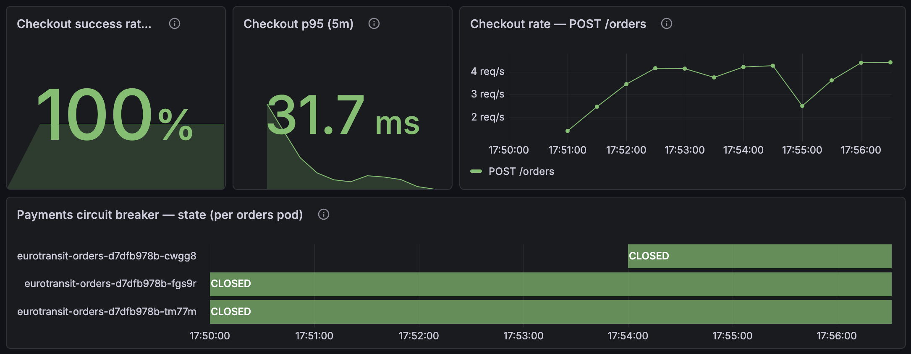

# CE-3 / Run 2 — Node drain re-run after the capacity fix (2026-07-13, 15:53 UTC)

*Execution record for [`ce-3-node-disruption.md`](ce-3-node-disruption.md). Purpose:
re-test the availability hypothesis that run 1 **failed**, after the run-1 capacity
finding was fixed — not with the 4th node run 1 recommended (infeasible: the regional
vCPU quota is capped at ~6, ADR 0005, increase denied) but by **CPU-request
rightsizing within the existing 3 nodes + Traefik HA** (PR #89: CNPG 250m→100m,
brokers 250m→150m, services 100m→75m, Traefik 2 replicas + anti-affinity + PDB).
**PASS** — the drain completed, checkout lost exactly **1 request of 12,448
(0.008 %)** vs run 1's 8.88 %, and every finding below sharpens the sizing picture.*

## Setup

| | |
|---|---|
| Date / operator | 2026-07-13 / @vojtech-n (Claude assisting with evidence gathering + doc; ADR 0019 gate on this record) |
| Injection | `kubectl cordon` + `drain --ignore-daemonsets --delete-emptydir-data --timeout=10m` — voluntary disruption, honours PDBs (no Chaos Mesh CR) |
| Node drained | `…vmss00000s` — the heaviest: catalog, frontend, inventory, orders replicas, **two Kafka brokers (0 and 2)**, `orders-db-1` **primary**, plus a Traefik replica, Prometheus, and the Strimzi operator |
| Pre-drain step | **planned CNPG switchover** of the orders-db primary to `db-2` on `…t` (runbook recommendation 3) — the drain then evicted `db-1` as a standby |
| Seed / load | `just seed-db ce-3` (pristine, route `…0001` @ 5000) · k6 `baseline.js`, 5 VUs, 15 m (run-1 parity) |
| Pre-flight schedulability | recorded (the check run 1 never had): post-PR-#89 requests 59/78/76 % CPU; draining `…s` (~1115m movable) fits into ~1233m free on `…r`+`…t` — **on paper, with ~120m slack** |

Timeline (UTC): **15:53:08** cordon + drain → ~15:54 stateless evictions done (incl.
Traefik replica) → 15:54–15:59 Kafka PDB holds `dual-role-2` (~25 `Cannot evict …
disruption budget` retries, 5 s apart) while broker 0's replacement comes up →
**15:59:14 drain COMPLETED (6 m 06 s)** → **16:01:20** uncordon → broker 2 (Pending
since ~15:59) schedules back, ISR 3/3, steady state restored.

## Result vs run 1

| | Run 1 (2026-07-12) | Run 2 (2026-07-13, after PR #89) |
|---|---|---|
| Drain | **never completed** (timeout) | **completed in 6 m 06 s** |
| Checkout | **8.88 % failed**, ~1 min hard gap | **1 / 12,448 failed (0.008 %)**, checkout_success 100 % |
| Gateway | single Traefik = SPOF, ~1 min no response | HA pair: the evicted replica cost exactly **one** `connection refused` (t≈171 s, matching the eviction) before the LB pulled the backend |
| Restart cascade | probe-timeout crashloops across services | **one** restart total (`orders-db-1`, its own standby rebuild) |
| HPA behaviour | scaled up on starvation CPU, Pending pods deepened the pressure | flapped 2→4 on startup-burst CPU, **bounded** (max 4), one Pending pod, self-resolved |
| Data integrity | 0 lost / 0 duplicate | 0 lost / 0 duplicate (below) |

## Verification (pristine seed → exact reconciliation)

| Check | Result |
|---|---|
| Client count = DB terminal count | ✅ k6 **3889** iterations = **3889 CONFIRMED**, 0 FAILED, 0 non-terminal |
| Error budget | ✅ 0.008 % client-side « 1 % budget; server-side **Errors % 5xx: No data** for the whole window |
| Latency | ✅ `place_order` p95 113 ms client / 31.7 ms server (5 m), thresholds green |
| No double charge / duplicates | ✅ 0 orders with > 1 intent; consumer lag ≈ 0 throughout |
| PDBs | ✅ Kafka `minAvailable: 2` held broker 2 until broker 0 was Ready — sequential eviction, in the drain log verbatim |
| Steady state restored | ✅ all pods Running post-uncordon, ISR 3/3, HPA back to baseline |
| Breakers | ✅ CLOSED on all orders pods — including the replacement pod mid-window |

## Findings (the run-2 contributions to the sizing picture)

1. **Operator/broker co-location adds ~5 minutes.** The drain evicted the Strimzi
   operator and broker 0 near-simultaneously; the restarted operator's first
   reconciliation burned a 5-minute timeout waiting on the already-gone pod before
   recreating it — and the Kafka PDB (correctly) held broker 2 the whole time. The
   drain's 6 m duration is essentially this serialization. Follow-up candidate:
   anti-affinity between the operator and its brokers, or a pre-drain operator
   relocation step in the upgrade runbook.
2. **The HPA flap consumed the drain headroom.** Inventory scaled 2→4 on
   startup-burst CPU (the %-of-request sensitivity documented in PR #89); the two
   extra pods (~150m + memory) ate the ~120m paper slack, and one of them sat
   Pending. Bounded and harmless here — but it is *the* reason finding 3 happened.
3. **The last broker could not be re-placed during the window.** Broker 2's
   replacement went `FailedScheduling: 1 Insufficient memory, 2 Insufficient cpu`
   and waited Pending until the uncordon (then landed back on `…s`). No impact —
   Kafka ran at ISR 2 = min ISR, the CE-4-proven regime — and it is the same
   hypothesis-consistent "Pending until the drain ends" pattern the runbook already
   documents for the DB standby. But it quantifies the limit precisely: **the
   quota-capped cluster survives a drain with full money-path availability, yet
   cannot re-place 100 % of the drained stateful set while the node is out.**
   Memory, not CPU, was the binding constraint for the broker (768Mi request).
4. **Traefik HA converted run 1's worst symptom into noise**: ~1 minute of gateway
   silence became a single refused request. (Corroborating pre-fix evidence: before
   PR #89 rolled out, node `…t` had rejected an AKS eraser addon pod at admission —
   short by 18 millicores.)

Evidence: [`ce-3-evidence/`](ce-3-evidence/) — drain log with timestamps (the PDB
retry loop verbatim), PDB/pod watch logs, pre-flight placement and PDB snapshots.

## Dashboard captures

Native Grafana (panels render in CEST = UTC+2; the drain window is ~17:53–17:59 on
the panels). Sequence `-1.x` → `-3.x` covers early window → recovery:

**Checkout SLIs + breaker** — [`ce3-run2-red-money-path-1.2.png`](ce-3-images/ce3-run2-red-money-path-1.2.png):

Checkout success 100 %, p95 31.7 ms, breakers CLOSED on all three orders pods —
including the replacement (`…-cwgg8`) that came up mid-drain.

**RED per service** — [`ce3-run2-red-money-path-3.1.png`](ce-3-images/ce3-run2-red-money-path-3.1.png):
Errors % 5xx **No data** across the entire run; a brief rate dip during the eviction
churn (~17:53–54), then steady; consumer lag flat at ≈ 0.

**USE infrastructure** — [`ce3-run2-use-infrastructure-1.1.png`](ce-3-images/ce3-run2-use-infrastructure-1.1.png):
short CPU-throttling spikes from rescheduled JVM startups (bounded, no cascade);
**container restarts: exactly one** (`orders-db-1` during its standby rebuild,
17:56 CEST) — contrast with run 1's restart step.

*(Full set: `ce3-run2-red-money-path-{1,2,3}.{1,2}.png`, `ce3-run2-use-infrastructure-1.{1,2}.png`.)*

## Outcome

| Date | Node drained | Load | Drain result | Checkout during drain | Data integrity | PDBs | Outcome |
|------|--------------|------|--------------|-----------------------|----------------|------|---------|
| 2026-07-13 | `…s` (most critical-path pods + orders-db primary, switched over first) | k6 5 VUs, 15 m, pristine seed | **completed, 6 m 06 s** | **0.008 % failed (1/12,448)**, success 100 % | ✅ 3889 = 3889, 0 lost/duplicate | Kafka PDB sequenced broker evictions; singleton-DB node avoided by design | **PASS (hypothesis held)** |

## Conclusion

> **Draft — pending team ratification (ADR 0019).**

The availability hypothesis that run 1 falsified **holds after the capacity fix**:
with ~1250m of CPU-requests freed (PR #89) the drain completed, every money-path
service kept serving, and the whole disruption cost one gateway request. The fix
worked *within* the quota constraint that made run 1's "add a 4th node"
recommendation infeasible — found the limit → fixed the sizing within the real
constraint → proven under the same fault. The margin, however, is exactly as thin
as the arithmetic said: the HPA's startup-burst flap consumed the slack and left
the last Kafka broker un-placeable for the duration of the window (harmless at
min ISR, but zero redundancy margin during drains). The cluster now *survives*
node maintenance; it does not yet *shrug it off*.
