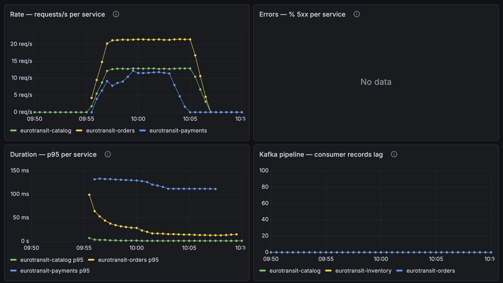
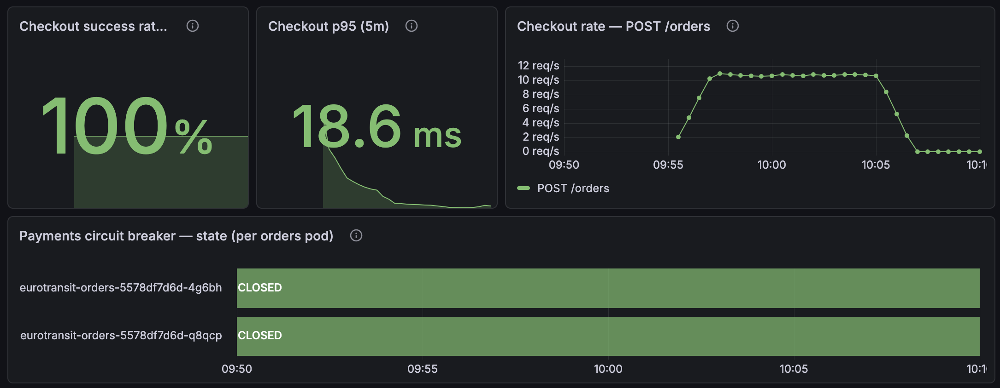

# CE-4 / Run 1 — Kafka network partition, broker 1 isolated (2026-07-13)

*Execution record for [`ce-4-kafka-partition.md`](ce-4-kafka-partition.md). One run:
Chaos Mesh `NetworkChaos` cut broker `dual-role-1` off from the entire `eurotransit`
namespace (peers + all app clients, both directions) for 5 minutes, under continuous
checkout load. **PASS** — no checkout impact, no event lost, no duplicate.*

## Setup

| | |
|---|---|
| Date / operator | 2026-07-13 / @vojtech-n (Claude assisting with harness + doc, per session; ADR 0019 gate on this record) |
| Injection | `NetworkChaos` `action: partition`, `mode: one`, `direction: both`, target = all pods in `eurotransit` — [`ce-4-kafka-partition.yaml`](ce-4-kafka-partition.yaml) |
| Isolated broker | `eurotransit-kafka-dual-role-1` (broker id 1) — picked by Chaos Mesh, confirmed in the `NetworkChaos` records |
| Topology | ADR 0021: 3 dual-role KRaft nodes, all topics RF 3, `min.insync.replicas: 2` — all KafkaTopics Ready at RF 3 pre-flight |
| DB state | `just seed-db ce-4`: full wipe, route `…0001` at 5000/5000 seats — pristine cross-DB state, so post-run counts are trustworthy without time-window filtering |
| Load | k6 `baseline.js`, 12 VUs, 10 m, route `…0001` via the Traefik gateway |
| T0 (inject) | **07:56:58 UTC** (Chaos Mesh apply event) |
| T_heal | ~**08:01:58 UTC** (5 m duration self-expired; object deleted afterwards with `just chaos-clean`) |

## Evidence

- 
  *Per-service RED across the run (dashboard times are CEST = UTC+2). Errors panel: no
  data — zero 5xx. Consumer records-lag: flat at ~0 through the entire fault window.*
- 
  *Checkout success 100 %, p95 18.6 ms, `POST /orders` rate steady through the fault;
  Payments circuit breaker CLOSED on both Orders pods throughout — the partition never
  touched the synchronous path.*
- Mid-window ISR state, captured from broker 0 at ~T0+3 m (money-path topics; the full
  output, including all 50 `__consumer_offsets` partitions, showed the same `Isr` sets —
  broker 1 evicted everywhere):

  ```
  $ kafka-topics.sh --describe --under-replicated-partitions   (from dual-role-0)
  Topic: order-placed        Partition: 0  Leader: 2  Replicas: 2,0,1  Isr: 2,0
  Topic: order-placed        Partition: 1  Leader: 0  Replicas: 0,1,2  Isr: 0,2
  Topic: order-placed        Partition: 2  Leader: 2  Replicas: 1,2,0  Isr: 2,0
  Topic: inventory-reserved  Partition: 0  Leader: 2  Replicas: 1,2,0  Isr: 2,0
  Topic: inventory-reserved  Partition: 1  Leader: 2  Replicas: 2,0,1  Isr: 2,0
  Topic: inventory-reserved  Partition: 2  Leader: 0  Replicas: 0,1,2  Isr: 0,2
  Topic: payment-authorized  Partition: 0  Leader: 2  Replicas: 1,2,0  Isr: 2,0
  Topic: payment-authorized  Partition: 1  Leader: 2  Replicas: 2,0,1  Isr: 2,0
  Topic: payment-authorized  Partition: 2  Leader: 0  Replicas: 0,1,2  Isr: 0,2
  Topic: order-confirmed     Partition: 0  Leader: 2  Replicas: 2,0,1  Isr: 2,0
  Topic: order-confirmed     Partition: 1  Leader: 0  Replicas: 0,1,2  Isr: 0,2
  Topic: order-confirmed     Partition: 2  Leader: 2  Replicas: 1,2,0  Isr: 2,0
  Topic: order-failed        Partition: 0  Leader: 2  Replicas: 1,2,0  Isr: 2,0
  Topic: order-failed        Partition: 1  Leader: 2  Replicas: 2,0,1  Isr: 2,0
  Topic: order-failed        Partition: 2  Leader: 0  Replicas: 0,1,2  Isr: 0,2
  ```

  After heal the same command returned **empty** — ISR restored to 3/3.

## Timeline and observations

- **T0 07:56:58** — partition applied. Broker 1 evicted from the ISR of **every**
  partition of every topic, including `__consumer_offsets`; leadership consolidated on
  brokers 0/2; ISR shrank to 2 = min ISR on all partitions (captured via
  `kafka-topics.sh --describe --under-replicated-partitions` from broker 0). Writes
  kept flowing: with RF 3 / min ISR 2, two in-sync replicas were sufficient to ack.
- **T0+26 s (07:57:24)** — the only producer stress of the run: a burst of
  `REQUEST_TIMED_OUT` / "Disconnected from node 1 due to timeout" on
  `order-placed-2` (a partition previously led by broker 1) in both Orders pods. The
  idempotent producer **retried and succeeded against the new leader — zero failed
  sends**. Consumers logged matching one-off `DisconnectException` fetch errors to
  node 1, then reconnected to the new leaders.
- **Consumer lag: never visibly nonzero.** At ~10.6 orders/s the redelivery/reconnect
  backlog cleared faster than the 15 s scrape interval — the "possible lag spike" in
  the hypothesis resolved to sub-scrape-interval.
- **Checkout during the fault: unaffected.** k6 thresholds all green — checkout
  success **100 %** (6365/6365), **0 failed of 20,371 requests, 0 × 429**,
  `place_order` p95 **73.5 ms** (max 1.65 s, the single visible trace of the
  leadership movement), catalog browsing 100 % healthy.
- **T_heal ~08:01:58** — fault self-expired. Broker 1 rejoined:
  under-replicated-partitions query **empty** (ISR back to 3/3) on the first
  post-heal check. `NOT_COORDINATOR` rediscovery events at **08:09:01** in both
  Orders pods mark the (benign) group-coordinator migration after the rejoin —
  convergence was complete by then at the latest.
- *Honesty footnote:* two Payments `ReadTimeoutException` warnings at 07:55:08
  pre-date the injection by ~2 minutes and are unrelated to CE-4 (CE-1 territory;
  no user-visible effect — k6 recorded 0 failed requests).

## Verification (after convergence)

| Check | Result |
|---|---|
| **Nothing lost** — client count = DB terminal count | ✅ k6 submitted **6365**; ordersdb has **5000 CONFIRMED + 1365 FAILED = 6365**, 0 non-terminal |
| **Nothing duplicated** — exactly-once effect | ✅ `processed_events` = **6365**, exactly one per order |
| **I1** — no oversell | ✅ available = 0, `0 ≤ 0 ≤ 5000`; exactly **5000** `RESERVED` |
| **I2** — seats reconcile | ✅ `5000 − 0 = Σ reserved (5000)` |
| **I3** — no duplicate reservation | ✅ 0 duplicate `(order_id, route_id)` |
| **No double charge** | ✅ 5000 payment intents, **0** orders with > 1 intent |
| **FAILED orders uncharged** | ✅ 1365 FAILED are post-sell-out reservation rejections; intents (5000) = CONFIRMED (5000), so none reached Payments |
| **Notifications** | ✅ 5000 SENT = one per confirmed order |
| **DLT empty** | ✅ `order-confirmed.DLT` end offsets 0/0/0 |
| **Broker rejoin** | ✅ ISR 3/3, under-replicated set empty after heal |

## Outcome

| Date | Operator | Isolated broker | Orders submitted | Lag peak | Producer errors seen | Lost events | Duplicates | Time to converge after heal | Outcome |
|------|----------|-----------------|------------------|----------|----------------------|-------------|------------|-----------------------------|---------|
| 2026-07-13 | @vojtech-n | `dual-role-1` (id 1) | 6365 | none visible (sub-scrape at ~10.6 orders/s) | `REQUEST_TIMED_OUT` burst at T0+26 s, all retried, 0 failed sends | **0** | **0** | ISR 3/3 on first post-heal check; coordinator rebalance done by 08:09 | **PASS** |

## Conclusion

> **Draft — pending team ratification (ADR 0019).**

The hypothesis held on all four points. (1) The KRaft quorum survived on 2/3
controllers — the cluster kept a leader and kept serving throughout. (2) Producers
kept acking: partition leadership moved to the two reachable brokers within ~26 s of
T0, and with RF 3 / min ISR 2 every acked write was on two replicas — the client-side
count (6365) matching the DB terminal count (6365) proves no acked event was lost.
(3) Consumers kept consuming with no visible lag; consumer-side idempotency absorbed
the redelivery window (`processed_events` = exactly one row per order). (4) On heal,
broker 1 rejoined and the ISR returned to 3/3 with no operator action. The checkout
SLIs never moved: 100 % success, 0 × 5xx, p95 73.5 ms — a full 5-minute broker
isolation consumed **zero** checkout error budget. The one design-relevant
observation: the producer's ~26 s blind spot on partitions led by the isolated broker
(bounded by `request.timeout.ms=30s`) never surfaced to users because the checkout
entry acks before the async tail — the decoupling did its job.
