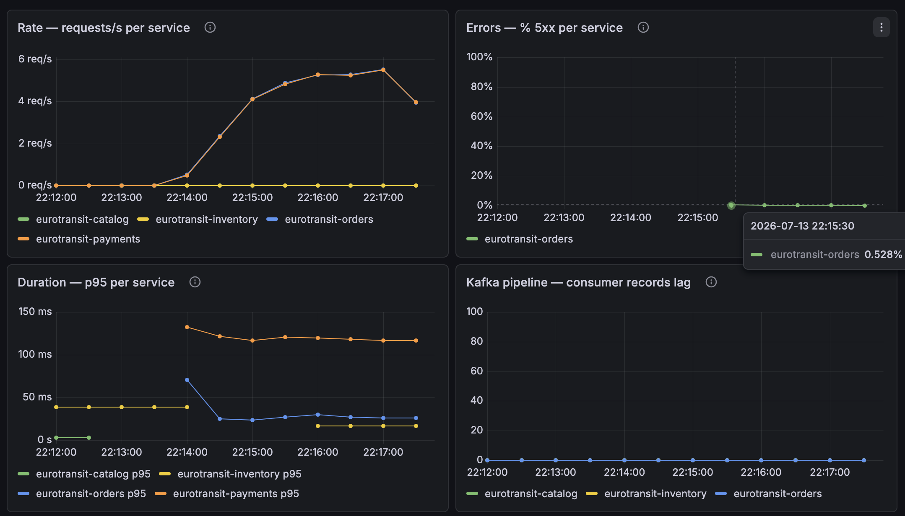

# CE-5 / Run 3 — Reviewer reproduction on a pristine seed (2026-07-13, 20:14 UTC)

*Execution record for [`ce-5-cnpg-failover.md`](ce-5-cnpg-failover.md). Purpose:
**independent reviewer reproduction** (ADR 0019) of run 2 — same method verbatim
([`ce-5-evidence/ce5-run3.sh`](ce-5-evidence/ce5-run3.sh): SIGKILL of the current
primary, 250 ms promotion watch, the ack-logging harness as the RTO/RPO instrument)
— on a **fully wiped, reseeded state** (`just seed-db ce-5`), upgrading run 2's
acked-set check to whole-database reconciliation. **PASS: RTO 16.8 s (run 2: 17.3 s),
RPO = 0 (435/435), rejoin at +50.4 s (run 2: +52.9 s)** — the failover behaviour is
reproducible to within a second on every measure.*

## Setup

| | |
|---|---|
| Date / operator | 2026-07-13 / @vojtech-n as reviewer (Claude assisting with analysis + doc; ADR 0019 gate on this record) |
| Injection | `kubectl delete pod --grace-period=0 --force` (SIGKILL) of the **current primary `eurotransit-orders-db-2`** — the run-1 lesson (graceful delete = smart shutdown = wrong scenario) baked into the script |
| Seed | `just seed-db ce-5`: full wipe, route `…0001` @ 5000/5000 |
| Pre-flight | 2/2 healthy, primary `db-2` (node `…t`), standby `db-1` (node `…r`), streaming **quorum sync, lag 0** — the async-degraded abort condition checked and clear |
| Load | `ce5-load.sh`, 3 workers ≈ 3 orders/s, every attempt logged with ms timestamp + orderId (`ce5-evidence/ce5-acks-run3.csv`, 1040 attempts) |
| T0 (SIGKILL issued) | **20:14:58.716 UTC** |
| Side verification | post-seed `rollout restart` of Catalog showed the fresh 5000/5000 in the frontend — **app #33's snapshot hydration verified in production** (the CE-2 run-3 finding, closed) |

## Timeline (UTC, from the 250 ms watch + ack log)

| T0 + | Event |
|---|---|
| 0 s | SIGKILL issued against `db-2` |
| ~0.5 s | cluster status: `ready 1/2`, phase **Failing over** |
| 0–2 s | a handful of writes still acked — the process-death lag after a `--force` delete (the API returns before the kernel kills; noted for honesty) |
| **2.0 → 14.5 s** | **write-error window (12.44 s)**: 19 failed attempts — 14 clean sub-second HTTP 500s + 5 curl timeouts at the harness's 5 s cap; **zero acks inside the gap, zero hangs** |
| **16.76 s** | **T1 — first acked write after the gap → RTO = 16.8 s** |
| 19.9 s | `status.currentPrimary` flips to `db-1` — the status plane lagging the data plane by ~3 s, same as run 2 (RTO taken from the ack log, per the method note) |
| 50.4 s | killed pod back, **2/2 healthy** — `db-2` re-attached as **standby, quorum sync, lag ≈ 0** (`ce5-evidence/ce5-cnpg-post-run3.txt`) |

## Verification

| Check | Result |
|---|---|
| **RTO ≤ 60 s (declared)** | ✅ **16.8 s** — promotion-dominated, app reconnect ≈ 0 (first post-gap request succeeded) |
| **RPO = 0 (declared)** | ✅ all **435** orders acked before T0 exist after promotion — **0 missing**, and every one reached **CONFIRMED** |
| Whole-run reconciliation (pristine seed) | ✅ **1021 acked (202) = 1021 CONFIRMED**, 0 non-terminal; 1040 attempts = 1021 + 19 failed |
| I1 / I2 | ✅ `5000 − 3979 = 1021 = Σ RESERVED reservations` |
| No double charge / duplicates | ✅ 1021 payment intents, 0 orders with > 1 intent; `processed_events` = 1021, one per order |
| Notifications | ✅ 1021 SENT = one per confirmed order |
| Clean failures, no hangs | ✅ every error bounded: 500s sub-second, worst case the 5 s harness cap; breaker **CLOSED** on both orders pods throughout (DB path fails fast — Payments never involved) |
| App self-recovery | ✅ **0 orders-pod restarts during the run**, no readiness flap — the R2DBC pool reconnected on its own, reproducing run 2. *(`…-fgs9r` carries 3 restarts from the PR #89 rollout settling at 14:59 UTC — five hours pre-run, stated to preempt confusion.)* |
| Rejoin without intervention | ✅ `db-2` standby, streaming quorum sync, zero manual steps |

Error budget: 19 failed attempts over a 12.4 s outage; on the RED dashboard the entire
event is **one 0.528 % 5xx sample** (2 m rate window) — the rest of the run is 0 × 5xx.

## Run 2 vs run 3 (the reproducibility table)

| Measure | Run 2 (2026-07-12) | Run 3 (2026-07-13, reviewer, pristine seed) |
|---|---|---|
| RTO (ack-log) | 17.3 s | **16.8 s** |
| Status-plane flip | T0+21.4 s | T0+19.9 s |
| Rejoin as standby | T0+52.9 s | T0+50.4 s |
| RPO | 0 (916 acked) | **0 (435 pre-T0 acked; 1021 whole-run)** |
| Orders-pod restarts | 0 | 0 |
| Manual intervention | none | none |

## Dashboard captures

Native Grafana (panels render in CEST = UTC+2; T0 20:14:58 UTC ≈ 22:15 on the panels).

**RED money path** — [`ce5-run3-red-money-path-2.1.png`](ce-5-images/ce5-run3-red-money-path-2.1.png):

The whole failover is a **single 0.528 % 5xx sample at 22:15:30**; rate/p95 steady
around it, consumer lag flat.

**USE infrastructure** — [`ce5-run3-use-infrastructure-1.1.png`](ce-5-images/ce5-run3-use-infrastructure-1.1.png):
container restarts flat at 0 through the window. *(The catalog CPU/throttling spikes
at ~22:12 are the post-seed Catalog rollout for the app-#33 verification — unrelated
to the failover.)*

*(Full set: `ce5-run3-red-money-path-{1,2}.{1,2}.png`, `ce5-run3-use-infrastructure-1.{1,2}.png`;
raw artifacts in [`ce-5-evidence/`](ce-5-evidence/): `ce5-acks-run3.csv`,
`ce5-timeline-run3.log`, `ce5-cnpg-post-run3.txt`, `ce5-events-run3.txt`, `ce5-run3.sh`.)*

## Outcome

| Date | Operator | Primary killed | T0 (kill) | Primary flipped at | T1 (first acked write) | RTO | Acked orders checked | Missing | Budget consumed | Outcome |
|------|----------|----------------|-----------|--------------------|------------------------|-----|----------------------|---------|-----------------|---------|
| 2026-07-13 | @vojtech-n (reviewer) | `-db-2`, SIGKILL, pristine seed | 20:14:58.716Z | T0+19.9 s (status; data plane ≈ +16.8 s) | **T0+16.76 s** | **16.8 s** | 435 pre-T0 (1021 whole-run) | **0** | 19 failed attempts / 12.4 s outage ≈ one 0.53 % 5xx sample | **PASS — run-2 result independently reproduced** |

## Conclusion

> **Draft — pending team ratification (ADR 0019).**

Run 2's result reproduces to within a second on every declared measure — RTO 16.8 s
vs 17.3 s, rejoin +50.4 s vs +52.9 s, RPO = 0 both times, zero restarts and zero
manual intervention both times — across a different day, a different operator, a
pristine database, and a primary running on a different node than run 2's. The
failover behaviour of the orders database can fairly be called a **stable property**
of the ADR 0021 topology, not a lucky run: detection + promotion dominates the RTO,
the application layer contributes nothing to it, and synchronous replication delivers
the declared RPO = 0 under an unplanned SIGKILL. With this, all five capstone chaos
experiments have at least one PASS on their declared objectives and three (CE-1,
CE-2, CE-5) carry independent reviewer reproductions.
