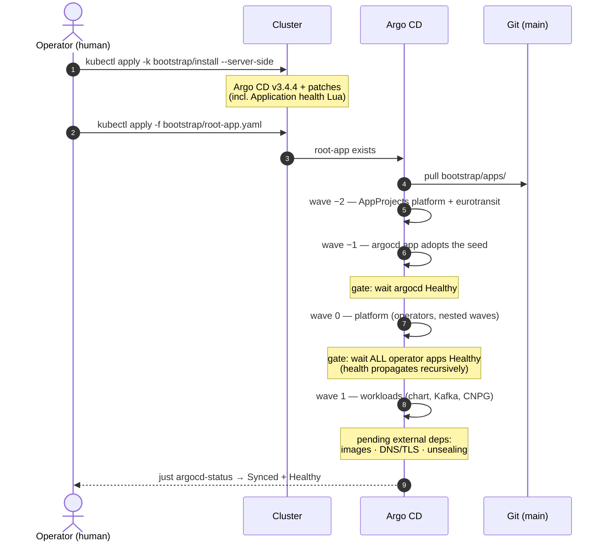
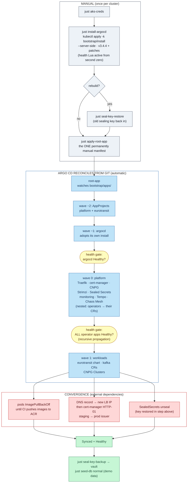
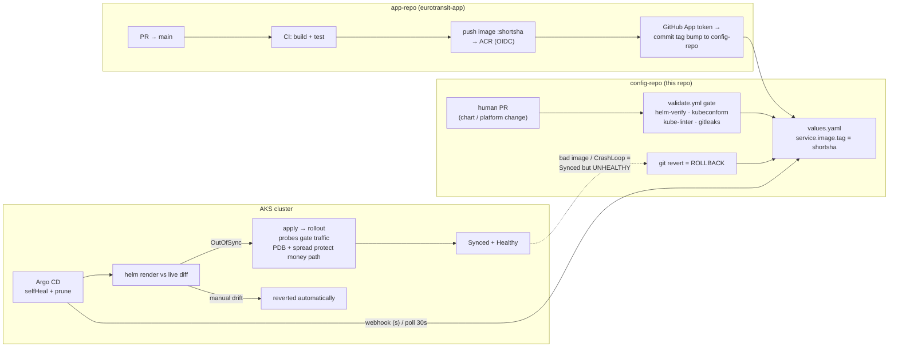

# Bootstrap Flow — EuroTransit

**Owner:** @vojtech-n (Delivery & Platform)

This document describes the **complete flow of a cluster bring-up**: the manual seed, the
app-of-apps unfolding in health-gated waves, convergence on external dependencies, and the
two loops that keep the system running once it is up. Companion to
[control-flow.md](../design/control-flow.md) and [data-flow.md](../design/data-flow.md),
which cover the money path *at runtime* — this document covers how the platform that runs
the money path **comes to exist**. Services, topics, payloads and schemas are deliberately
not re-described here; when the flows touch (e.g. probes gating a rollout), this document
links out instead of duplicating.

The design goal: **manually install exactly two things — Argo CD and one `Application`
manifest — and everything else is pulled from Git.** After that, the only write path into
the cluster is a commit to `main`.

---

## Part 1 — First-time bring-up

### 0. One-time Azure prerequisites (not per-cluster-rebuild)

Done once by the subscription Owner; survives cluster rebuilds:

| Step | What | Record |
|---|---|---|
| AKS cluster | `rg-eurotransit-g01` / `aks-eurotransit-g01`, 3× `B2s_v2`, Poland Central | ADR 0001, ADR 0005 |
| ACR push (CI) | `just acr-oidc` — GitHub OIDC → managed identity, AcrPush; no stored password | ADR 0010, `infra/acr-oidc/` |
| ACR pull (nodes) | `--attach-acr` — kubelet AcrPull via node identity; `imagePullSecrets: []` | ADR 0010 |
| Write-back GitHub App | short-lived token, Contents:write on this repo only | ADR 0007, `infra/gitops-writeback-app/` |

### 1. The bootstrap, step by step

1. **Point kubectl at the cluster.** `just aks-creds` fetches the kubeconfig
   (`az aks get-credentials`) and switches the current context to the AKS cluster.

2. **Seed Argo CD — the only imperative install.** `just install-argocd` runs
   `kubectl apply -k bootstrap/install --server-side`: the upstream Argo CD manifest
   **pinned to v3.4.4** plus four strategic-merge patches (`server.insecure` for Traefik
   TLS termination, GitHub SSO + RBAC, webhook secret patch-mode annotations, and the
   **Application health customization** — see [the health gates](#the-argo-cd-health-gates)
   below). Kustomize here is a deliberate island (ADR 0028). `--server-side` is required
   because Argo CD's own CRDs exceed the client-side-apply annotation size limit. The
   recipe then waits for the `applications.argoproj.io` CRD to be `Established` and for
   `argocd-server` to roll out.

3. **Rebuild only: restore the sealing key.** `just seal-key-restore
   ~/eurotransit-sealed-secrets-key-<date>.yaml` — **before** workloads need their
   secrets. A fresh sealed-secrets controller generates a new key, and no committed
   `SealedSecret` decrypts under it. See
   [sealed-secrets-key-dr.md](sealed-secrets-key-dr.md).

4. **Hand control to Git.** `just apply-root-app` applies `bootstrap/root-app.yaml` — the
   **one permanently manual manifest**. `root-app` watches `bootstrap/apps/` on `main`
   with `selfHeal` + `prune`; from here on, every change to the cluster is a commit.

5. **Watch the tree converge.** `just argocd-status` (`kubectl get applications -n
   argocd`) until everything is `Synced` + `Healthy`; some resources stay pending on
   [external dependencies](#3-convergence--external-dependencies) first.

`just aks-bootstrap [BRANCH]` is the same flow with `targetRevision` overridden, for
validating an unmerged branch on the cluster. Steady state is always `root-app` tracking
`main`.

### 2. What root-app unfolds (app-of-apps, health-gated waves)

`root-app` reconciles `bootstrap/apps/`, ordered by `argocd.argoproj.io/sync-wave`:

| Wave | Resource | Source path | Installs | Why this order |
|---|---|---|---|---|
| −2 | AppProjects `platform` + `eurotransit` | `bootstrap/apps/projects.yaml` | scoped blast radius (ADR 0011) | must exist before any Application references them |
| −1 | `argocd` Application | `bootstrap/install/` | Argo CD **itself** | adopts the manual seed — from now on Argo CD's version/config are Git-managed like everything else (`ignoreDifferences` on `argocd-secret` data, so selfHeal never wipes the runtime-generated keys — the lab04 incident) |
| 0 | `platform` Application | `platform/` (recurse) | Traefik, cert-manager, CloudNativePG, Strimzi, Sealed Secrets, kube-prometheus-stack, Tempo, Chaos Mesh | operators + CRDs must be Healthy before any CR that needs them |
| 1 | `workloads` Application | `apps/` | `eurotransit` (Helm chart), `kafka` (Kafka + KafkaTopic CRs), `data-infrastructure` (CNPG Clusters) | CRs would fail without wave 0's controllers/CRDs |

The `platform` Application repeats the pattern **one level down**, with finer waves inside
it: the operator Applications sit at its wave 0, and the CRs that need those operators
running — `ClusterIssuer`s, the Argo CD `IngressRoute`/`Certificate`, the Grafana
certificate — sit at its wave 1.

### The Argo CD health gates

Sync waves alone are **not enough** for an app-of-apps: out of the box, Argo CD has no
health assessment for `Application` resources, so a wave boundary only orders the
*creation* of the child Application objects — a wave-1 workload could sync while a wave-0
operator was still installing its CRDs and webhooks. Three controls close this gap
(ADR 0003):

1. **Restored `Application` health assessment.** `bootstrap/install/patch-argocd-cm.yaml`
   sets `resource.customizations.health.argoproj.io_Application` — Argo CD's documented
   Lua customization that returns each child Application's own `.status.health`. This
   turns every cross-Application wave boundary into a **health gate**, and the gate is
   **recursive**: `root-app` waits for `argocd` (wave −1) to be Healthy before creating
   `platform` (wave 0); `platform` in turn waits for its operator Applications before
   applying its own wave-1 CRs; only when `platform` reports Healthy does `root-app`
   create `workloads` (wave 1). Because the customization lives in the Kustomize seed
   *and* in the self-management `argocd` Application (same path), it is active before
   `root-app` is first applied and cannot drift afterwards (ADR 0028).

2. **`ServerSideApply=true`** on the operator Applications with large CRDs
   (cert-manager, CloudNativePG, Strimzi, kube-prometheus-stack) and on the `argocd`
   self-management app — client-side apply fails on the 262 kB annotation limit.

3. **`SkipDryRunOnMissingResource=true`** on the workload Applications, as defense in
   depth only: if API discovery or an admission webhook lands moments late, the CR sync
   retries instead of hard-failing. The validation this gives up is recovered in CI by
   `just helm-schema` / kubeconform (ADR 0013).

What "Healthy" means at the leaves — Deployments have their minimum available replicas
and pods pass readiness, the CloudNativePG `Cluster` and the Strimzi `Kafka` CR report
`Ready` — and the Lua customization propagates exactly that upward. The gate is
**fail-closed**: a genuinely unhealthy platform child holds the workload wave
indefinitely, which is the safe behavior but means bootstrap diagnosis starts with
*"which child Application is not Healthy?"* (`just argocd-status`).

### 3. Convergence — external dependencies

Wave 1 lands the workloads, but three things converge out-of-band before the tree is
fully `Synced` + `Healthy`:

- **Images** — pods sit in `ImagePullBackOff` until CI pushes the first images to ACR.
- **DNS + TLS** — the DNS record must point at the new LoadBalancer IP; then cert-manager
  completes HTTP-01, staging → prod issuer ([TLS runbook](tls-issuance-runbook.md)).
- **Secrets** — SealedSecrets unseal only if the sealing key was restored in step 3.

### 4. Bootstrap flow diagram

Gray is the manual phase, blue is Argo CD reconciling from Git, yellow pills are the
health gates from ADR 0003, and red is state blocked on an external dependency.

### 5. Post-bootstrap checklist

- [ ] `just argocd-status` — all Applications `Synced` + `Healthy`
- [ ] CI has pushed images (or accept `ImagePullBackOff` until first app-repo build)
- [ ] DNS record points at the new LoadBalancer IP; TLS issued (staging → prod, [TLS runbook](tls-issuance-runbook.md))
- [ ] `just seal-key-backup` → file into the team vault ([key DR runbook](sealed-secrets-key-dr.md))
- [ ] `just chaos-enable` if an experiment window is planned
- [ ] `just seed-db normal` for demo data

---

## Part 2 — Steady state: what happens once it's up

After bootstrap, **nobody deploys**. The system runs two loops:

**The delivery loop (event-driven, on every merge to app-repo `main`):**
CI builds and tests, pushes an immutable short-SHA image to ACR (OIDC — no
stored password), mints a short-lived GitHub App token, and commits a one-line
`image.tag` bump to `values.yaml` in this repo. Argo CD notices (webhook →
seconds, or the 30s fallback poll) and rolls the Deployment. Probes gate the rollout:
startup probe covers the JVM boot, readiness gates traffic, PDBs +
topology spread keep the money path available while pods cycle.

**The reconcile loop (continuous, `selfHeal` + `prune`):**
Argo CD continuously compares live state against the Helm render of `main`.
Manual drift is reverted; resources whose templates were deleted are pruned.
This is why hotfixing live with `kubectl edit` is impossible *by design* — and
why **rollback is `git revert`** on the offending commit, never
`kubectl rollout undo` (selfHeal would immediately re-apply the bad state).

### The manual-kubectl boundary in steady state

Argo CD owns the declarative **spec** rendered from Git. `kubectl` writes are
legitimate only **below the spec line** — state, data, and one-shot actions
that have no declarative form:

| Legitimate manual action | Why Argo can't own it |
|---|---|
| The bootstrap seed + `root-app.yaml` | chicken-and-egg: Argo can't install the first Argo |
| Sealing-key restore/backup ([runbook](sealed-secrets-key-dr.md)) | runtime private key; the one secret that can't be sealed with itself |
| `just seed-db`, `kubectl exec` SQL | database *contents* are data, not desired state |
| `just chaos <ce-N>` experiments | one-shot by design — selfHeal would re-inject a Git-managed fault forever (ADR 0017) |
| `kubectl delete pod`, CNPG promote | acts on instances/runtime, not spec; ReplicaSet/operator restores them |
| Logs, describe, port-forwards, `kubectl get ingressroute` | read-only observation never violates GitOps |
| Unsticking a deadlocked sync, stuck finalizers, leftover CNPG PVCs | repairing the reconciler's *ability* to act, not overriding Git |

Everything **above** the spec line — image tags, replicas, probes, any rendered
manifest — changes only via a commit, and reverts only via `git revert`.

---

*Related: [control-flow.md](../design/control-flow.md) / [data-flow.md](../design/data-flow.md) (the money path this platform runs) · [DELIVERY.md](../../DELIVERY.md) (decision index) · [sealed-secrets-key-dr.md](sealed-secrets-key-dr.md) · [tls-issuance-runbook.md](tls-issuance-runbook.md) · ADR 0003 (health gates + sync options) · ADR 0009 (trunk-based, rollback) · ADR 0011 (AppProjects) · ADR 0028 (Helm apps / Kustomize seed)*
