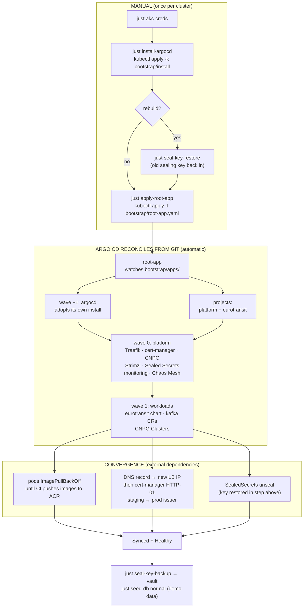
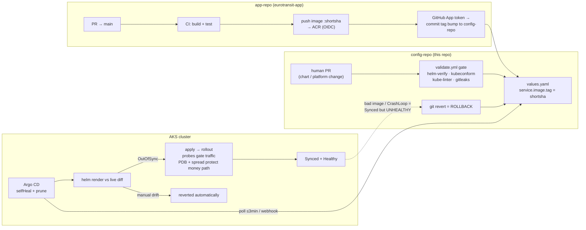

# Cluster bootstrap & steady state — how the stack starts and runs

**Owner:** @vojtech-n (Delivery & Platform)
**Covers:** first-time bring-up of a cluster from this repo, the app-of-apps
wave order, and what the system does by itself once Argo CD is running.

The design goal: **manually install exactly two things — Argo CD and one
`Application` manifest — and everything else is pulled from Git.** After that,
the only write path into the cluster is a commit to `main`.

---

## Part 1 — First-time bring-up

### 0. One-time Azure prerequisites (not per-cluster-rebuild)

Done once by the subscription Owner; survives cluster rebuilds:

| Step | What | Record |
|---|---|---|
| AKS cluster | `rg-eurotransit-g01` / `aks-eurotransit-g01`, 3× `B2s_v2`, Poland Central | ADR 0001, ADR 0005 |
| ACR push (CI) | `just acr-oidc` — GitHub OIDC → managed identity, AcrPush; no stored password | ADR 0010, `infra/acr-oidc/` |
| ACR pull (nodes) | `--attach-acr` — kubelet AcrPull via node identity; `imagePullSecrets: []` | ADR 0010 |
| Write-back GitHub App | short-lived token, Contents:write on this repo only | ADR 0007, `infra/gitops-writeback-app/` |

### 1. Bootstrap sequence

```bash
just aks-creds          # fetch kubeconfig, switch context to the AKS cluster

just install-argocd     # imperative SEED: kubectl apply -k bootstrap/install --server-side
                        # (Argo CD pinned to v3.4.4 + repo patches; waits for CRDs + server)

# REBUILD ONLY: restore the sealing key BEFORE workloads need their secrets —
# a fresh controller generates a new key and no committed SealedSecret decrypts.
# See docs/delivery/sealed-secrets-key-dr.md
just seal-key-restore ~/eurotransit-sealed-secrets-key-<date>.yaml

just apply-root-app     # kubectl apply -f bootstrap/root-app.yaml — the ONE
                        # permanently manual manifest; Git takes over from here

just argocd-status      # watch the tree converge
```

`just aks-bootstrap [BRANCH]` is the same flow with `targetRevision` overridden,
for validating an unmerged branch on the cluster. Steady state is always
`root-app` tracking `main`.

### 2. What root-app unfolds (app-of-apps, sync waves)

`root-app` reconciles `bootstrap/apps/`, whose Applications are ordered by
`argocd.argoproj.io/sync-wave` so nothing races ahead of what it depends on:

| Wave | Application | Source path | Installs | Why this order |
|---|---|---|---|---|
| −1 | `argocd` | `bootstrap/install/` | Argo CD **itself** | adopts the manual seed — from now on Argo CD's version/config are Git-managed like everything else |
| — | `projects` | `bootstrap/apps/projects.yaml` | AppProjects `platform` + `eurotransit` | scoped blast radius (ADR 0011) before anything syncs under them |
| 0 | `platform` | `platform/` (recurse) | Traefik, cert-manager, CloudNativePG, Strimzi, Sealed Secrets, kube-prometheus-stack, Chaos Mesh | operators + CRDs must be Healthy before any CR that needs them |
| 1 | `workloads` | `apps/` | `eurotransit` (Helm chart), `kafka` (Kafka + KafkaTopic CRs), `data-infrastructure` (CNPG Clusters) | CRs would fail without wave 0's controllers/CRDs |

Two sync-option details make this work at all (ADR 0003): `ServerSideApply`
for the operators with CRDs too large for client-side apply, and
`SkipDryRunOnMissingResource` so wave-1 CRs retry instead of hard-failing if a
CRD lands moments late.

### 3. Bootstrap control flow



### 4. Post-bootstrap checklist

- [ ] `just argocd-status` — all Applications `Synced` + `Healthy`
- [ ] CI has pushed images (or accept `ImagePullBackOff` until first app-repo build)
- [ ] DNS record points at the new LoadBalancer IP; TLS issued (staging → prod, [TLS runbook](tls-issuance-runbook.md))
- [ ] `just seal-key-backup` → file into the team vault ([key DR runbook](sealed-secrets-key-dr.md))
- [ ] `just chaos-enable` if an experiment window is planned
- [ ] `just seed-db normal` for demo data

---

## Part 2 — Steady state: what happens once it's up

After bootstrap, **nobody deploys**. The system runs two loops:

**The delivery loop (event-driven, on every merge to app-repo `main`):**
CI builds and tests, pushes an immutable short-SHA image to ACR (OIDC — no
stored password), mints a short-lived GitHub App token, and commits a one-line
`image.tag` bump to `values.yaml` in this repo. Argo CD notices (webhook →
seconds, or poll → ≤3 min) and rolls the Deployment. Probes gate the rollout:
startup probe covers the JVM boot, readiness gates traffic, PDBs +
topology spread keep the money path available while pods cycle.

**The reconcile loop (continuous, `selfHeal` + `prune`):**
every ~3 minutes Argo CD compares live state against the Helm render of `main`.
Manual drift is reverted; resources whose templates were deleted are pruned.
This is why hotfixing live with `kubectl edit` is impossible *by design* — and
why **rollback is `git revert`** on the offending commit, never
`kubectl rollout undo` (selfHeal would immediately re-apply the bad state).



### The manual-kubectl boundary in steady state

Argo CD owns the declarative **spec** rendered from Git. `kubectl` writes are
legitimate only **below the spec line** — state, data, and one-shot actions
that have no declarative form:

| Legitimate manual action | Why Argo can't own it |
|---|---|
| The bootstrap seed + `root-app.yaml` | chicken-and-egg: Argo can't install the first Argo |
| Sealing-key restore/backup ([runbook](sealed-secrets-key-dr.md)) | runtime private key; the one secret that can't be sealed with itself |
| `just seed-db`, `kubectl exec` SQL | database *contents* are data, not desired state |
| `just chaos <ce-N>` experiments | one-shot by design — selfHeal would re-inject a Git-managed fault forever (ADR 0017) |
| `kubectl delete pod`, CNPG promote | acts on instances/runtime, not spec; ReplicaSet/operator restores them |
| Logs, describe, port-forwards, `kubectl get ingressroute` | read-only observation never violates GitOps |
| Unsticking a deadlocked sync, stuck finalizers, leftover CNPG PVCs | repairing the reconciler's *ability* to act, not overriding Git |

Everything **above** the spec line — image tags, replicas, probes, any rendered
manifest — changes only via a commit, and reverts only via `git revert`.

---

*Related: [DELIVERY.md](../../DELIVERY.md) (decision index) · [sealed-secrets-key-dr.md](sealed-secrets-key-dr.md) · [tls-issuance-runbook.md](tls-issuance-runbook.md) · ADR 0003 (sync options) · ADR 0009 (trunk-based, rollback) · ADR 0011 (AppProjects)*
