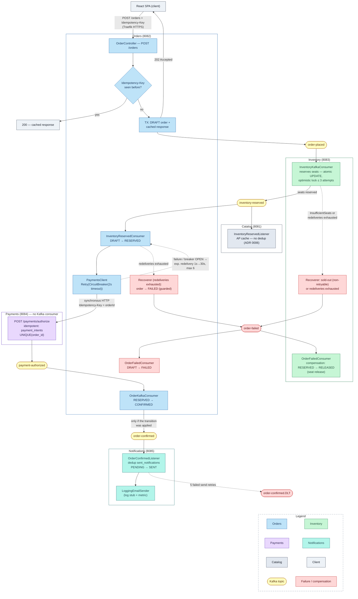
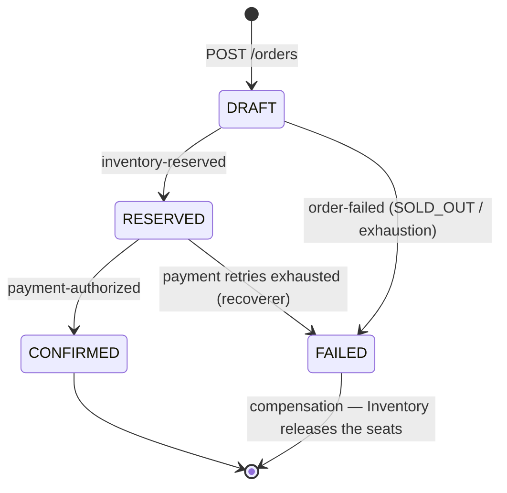
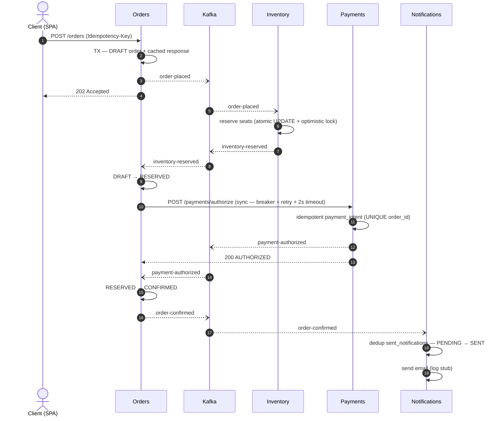

# Control Flow — EuroTransit

This document describes the **complete control flow of the money path**: the end-to-end purchase
journey from the client's `POST /orders` to the confirmation notification, including failure
paths and compensations. It is derived directly from the services' source code and the ADRs
(in particular config-repo ADR 0018 and `.agent/context/money-path.md`).

## Architecture at a glance

Five Kotlin/Spring Boot services plus a React SPA, each with its own PostgreSQL database,
connected through Kafka. The only synchronous cross-service call on the money path is
Orders → Payments (`POST /payments/authorize`), protected by a circuit breaker (ADR 0018).
**Payments has no Kafka consumer**: it is reached only via HTTP and only *produces*
`payment-authorized`.

| Service | Port | Role in the flow |
|---|---|---|
| frontend (SPA) | 8080 / 5173 | Sends `POST /orders` through Traefik |
| orders | 8082 | Orchestrator: order states, synchronous call to Payments |
| inventory | 8083 | Reserves/releases finite seats (atomic SQL) |
| payments | 8084 | Authorizes the payment (idempotent, HTTP only) |
| notifications | 8085 | Terminal asynchronous stage: confirmation email |
| catalog | 8081 | AP read cache, updated by events |

### Kafka topics

| Topic | Producer | Consumer |
|---|---|---|
| `order-placed` | Orders | Inventory |
| `inventory-reserved` | Inventory | Orders, Catalog |
| `payment-authorized` | Payments | Orders |
| `order-confirmed` | Orders | Notifications |
| `order-failed` | Inventory (recoverer), Orders (recoverer) | Orders, Inventory |
| `order-confirmed.DLT` | Notifications (recoverer) | — (manual inspection) |

## Control flow diagram (complete, with failure paths)

Solid arrows are the normal flow; dashed arrows are retries/failures.
Yellow pills are Kafka topics, red nodes are failure/compensation paths, and each service
has its own color.

## Order state machine

The states live in `Order.kt` (Orders). There is no `PAID` state: it was removed together with
the synchronous authorization (ADR 0018). Every transition is **conditional**
(`UPDATE ... WHERE status = :expected`), so a replay is a no-op, never an error.

## Sequence — happy path

## The flow step by step

1. **Client → Orders.** The SPA sends `POST /orders` through Traefik with a mandatory
   `Idempotency-Key` header. `OrderService.placeOrder` first checks the idempotency table: a
   previously seen key returns **200 with the cached response**, creating nothing. Otherwise, in
   a single transaction, it creates the order in `DRAFT` state and stores the cached response;
   then, **outside** the transaction (at-least-once safe), it publishes `order-placed` and
   replies **202 Accepted** — from here on the pipeline is asynchronous.

2. **Inventory reserves the seats.** `InventoryKafkaConsumer` deduplicates on
   `processed_events` (`{orderId}:{eventType}`), then `InventoryService.reserveSeats` runs a
   conditional atomic UPDATE (`available_seats >= :seats AND version = :expected`) with
   optimistic locking and at most 3 attempts: two customers can never buy the last seat.
   Success → publishes `inventory-reserved`.

3. **Orders moves to RESERVED and authorizes the payment — the only synchronous point.**
   `InventoryReservedConsumer` deduplicates, applies the conditional `DRAFT → RESERVED`
   transition and calls `PaymentsClient.authorize`: an HTTP call wrapped in
   `Retry(CircuitBreaker(2s timeout))` — 3 attempts with exponential backoff and jitter, breaker
   with window 20, 50% threshold, 30s open (ADR 0018). The dedup record is written **only after
   success**: a failure lets the exception propagate to the `DefaultErrorHandler`, which
   redelivers the event with exponential backoff (1s → 30s, max 6 attempts) while the order sits
   safely in `RESERVED`.

4. **Payments authorizes idempotently.** `AuthorizeController` validates that
   `Idempotency-Key = orderId`, and `PaymentService` creates at most one `payment_intent` per
   order (UNIQUE index on `order_id`): a retry never double-charges. After authorization it
   publishes `payment-authorized` — republishing on a replay is safe because the downstream
   consumer deduplicates.

5. **Orders confirms.** `OrderKafkaConsumer` deduplicates, applies `RESERVED → CONFIRMED` in the
   same transaction as the dedup record, and publishes `order-confirmed` **only if the
   transition was actually applied** — otherwise Notifications would send a confirmation for an
   unconfirmed order.

6. **Notifications closes the flow.** `OrderConfirmedListener` consumes `order-confirmed`
   (its only trigger — ADR-001), deduplicates with the two-phase `PENDING → SENT` row in
   `sent_notifications` (ADR-002/003) and "sends" via `LoggingEmailSender` (a log stub with the
   `notifications_sent_total` metric). Manual per-record ack: the offset advances only once
   processing completes.

## Failure paths and compensations

**Sold-out.** `InsufficientSeatsException` is classified **non-retryable**: sold-out is a fact,
not a glitch. Inventory's recoverer immediately publishes `order-failed(SOLD_OUT)`;
`OrderFailedConsumer` in Orders applies `DRAFT → FAILED` (adversarial-audit fix #19 — before
that, the order would sit in `DRAFT` forever).

**Payments down or slow.** The breaker fails fast when OPEN (`CallNotPermittedException`,
non-retryable for the local retry) and the exception reaches the Kafka error handler: the
exponential redelivery effectively is the "payment queued for retry". Once the 6 attempts are
exhausted, Orders' recoverer marks the order `FAILED` and publishes `order-failed` — but with a
**guard** (agent-log case 24): it publishes only if the `FAILED` transition happened now or the
order is already `FAILED`, because an authorization that succeeded during a HALF_OPEN probe may
have already confirmed the order, and compensating in that state would release seats belonging
to a confirmed order.

**Seat compensation.** `order-failed` is also consumed by Inventory: the conditional
`RESERVED → RELEASED` transition gives the seats back to the route exactly once, even under
replay. Inventory's recoverer additionally has an anti-feedback-loop guard: a failing
`order-failed` never republishes `order-failed`.

**Notifications down.** The service is reached only through Kafka, so its outage **never fails
checkout** (graceful degradation — it is outside the SLO success criterion). A failing send is
retried 5 times (500ms) and then routed to `order-confirmed.DLT`; a transient dedup-DB error
instead blocks-and-lags (never drops).

**Poison messages.** An undeserializable payload (`ErrorHandlingDeserializer` → `null`) is
acked and skipped in every consumer, without blocking the partition.

**Cooperative shutdown.** Every consumer checks `GracefulShutdownManager`: while draining, the
event is skipped **without ack**, so Kafka rebalances it to a healthy instance; in-flight
operations are tracked and awaited.

## Idempotency — the complete map

Every handler may receive the same message more than once (at-least-once), so every step has a
double layer of protection: dedup + conditional transition.

| Point | Mechanism | Key |
|---|---|---|
| `POST /orders` | `idempotency_records` table + cached response | `Idempotency-Key` header |
| Orders / Inventory consumers | `processed_events` table + conditional transitions | `{orderId}:{eventType}` |
| `POST /payments/authorize` | UNIQUE `payment_intents.order_id` | `{orderId}:payment` |
| Notifications | two-phase row in `sent_notifications` | `order_id` |
| Catalog | **no dedup** — the AP cache tolerates skip/replay | — (ADR 0006) |

## Code references

Critical path for the SLOs: steps 1–5 (Notifications excluded). Key files:
`orders/service/OrderService.kt`, `orders/kafka/InventoryReservedConsumer.kt`,
`orders/kafka/OrderKafkaConsumer.kt`, `orders/kafka/OrderFailedConsumer.kt`,
`orders/client/PaymentsClient.kt`, `orders/config/KafkaErrorHandlingConfig.kt`,
`inventory/service/InventoryService.kt`, `inventory/config/KafkaErrorHandlingConfig.kt`,
`payments/web/AuthorizeController.kt`, `payments/service/PaymentService.kt`,
`notifications/listener/OrderConfirmedListener.kt`, `notifications/config/KafkaConfig.kt`.
Design: config-repo `.agent/context/money-path.md`, config-repo ADR 0018, app ADR-001…008,
`docs/design/idempotency.md`.
