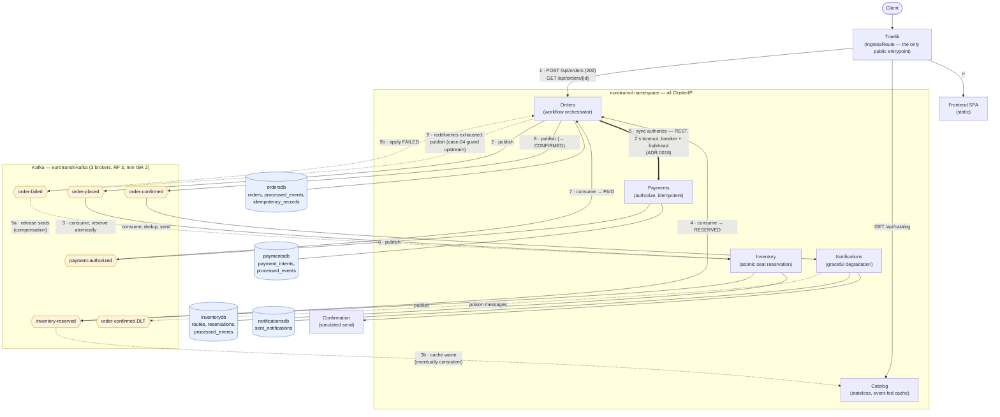

# Data flow — EuroTransit money path

*Owner: @vojtech-n. Edges verified against the application code (producers/consumers
per topic) and the live broker consumer groups, 2026-07-13. Companion docs:
[`service-boundaries.md`](service-boundaries.md), [`consistency.md`](consistency.md),
[`idempotency.md`](idempotency.md); topic ↔ producer/consumer table in
`.agent/context/kafka-topics.md` — keep the two in sync in the same PR (app ADR-001).*

## System data-flow diagram

Solid arrows = the happy money path (numbered); the bold arrow (5) is the single
synchronous cross-service call; dashed arrows = compensation, dead-lettering, and the
eventually-consistent cache feed.

## The money path, step by step

1. Client `POST /api/orders` through Traefik → Orders persists the order (`DRAFT`) and
   acks **202** immediately — the async pipeline does the rest.
2. Orders publishes `order-placed`.
3. Inventory consumes it: atomic conditional `UPDATE` on `available_seats` +
   `processed_events` dedup row **in the same transaction** ([consistency
   model](consistency.md), CP) → publishes `inventory-reserved`.
   **3b.** Catalog consumes the same event to keep its browse cache warm — it may lag;
   that is accepted staleness (app ADR 0006).
4. Orders consumes `inventory-reserved` → order `RESERVED`.
5. Orders calls Payments **synchronously**: REST, 2 s timeout, Resilience4j circuit
   breaker + bulkhead (ADR 0018). This is the only sync cross-service edge — and the
   CE-1 chaos target.
6. Payments authorizes idempotently (`UNIQUE(order_id)` + idempotency key, exactly one
   `payment_intent` per order) and publishes `payment-authorized`.
7. Orders consumes it → order `PAID` → publishes `order-confirmed` (8), order
   `CONFIRMED`.
8. Notifications consumes `order-confirmed`, dedups via `sent_notifications`
   (per app ADR-002), sends the confirmation. Failures must not propagate to checkout;
   poison messages go to `order-confirmed.DLT`.
9. **Failure branch:** if payment-stage redeliveries are exhausted, Orders publishes
   `order-failed` (the case-24 guard first checks the order has not already reached a
   terminal SUCCESS state). Inventory consumes it to **release the reserved seats**
   (9a); Orders applies the `FAILED` transition (9b).

Order states: `DRAFT → RESERVED → PAID → CONFIRMED`, or `→ FAILED` with compensation.

## Invariants carried by this flow

- Every consumer is idempotent: `processed_events` keyed `{orderId}:{eventType}`
  ([idempotency scheme](idempotency.md)) — at-least-once delivery never
  double-processes.
- Exactly one `payment_intent` per order (DB-level `UNIQUE`).
- No oversell: the reservation is a conditional atomic `UPDATE`; only one caller wins
  the last seat.
- Notifications can fail entirely without failing checkout (graceful degradation).
- `notification-requested` is declared as a topic CR but **unwired** (app ADR-001) —
  deliberately absent from this diagram.
