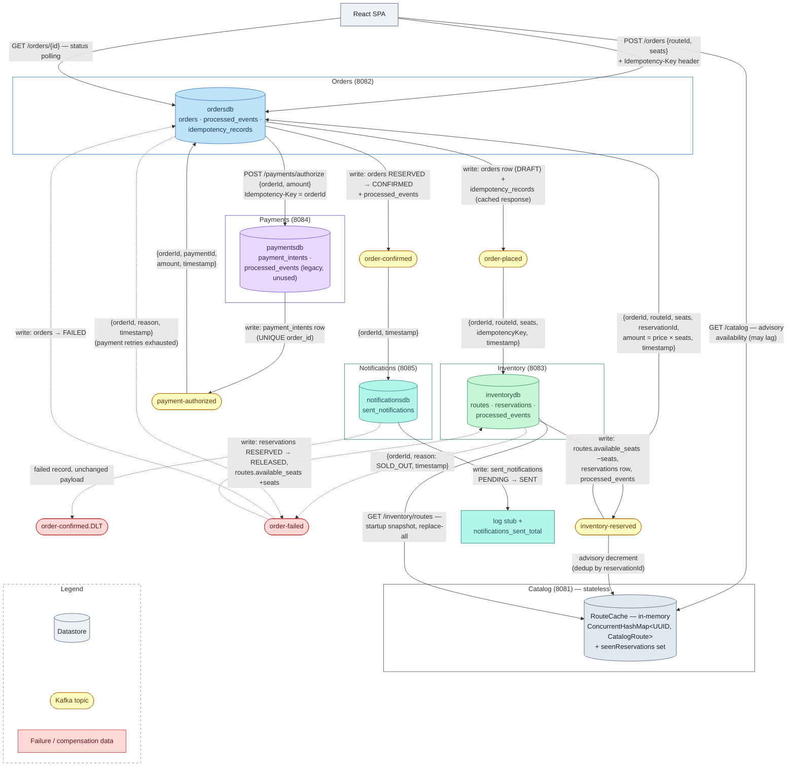
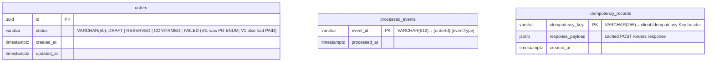
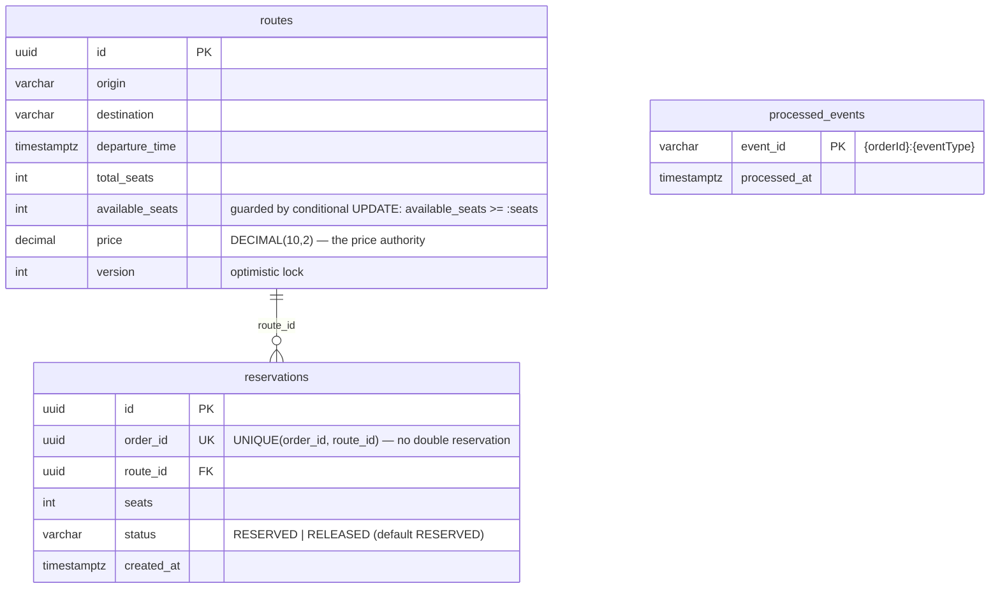
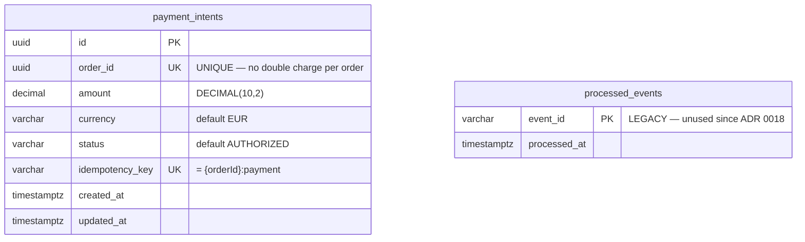
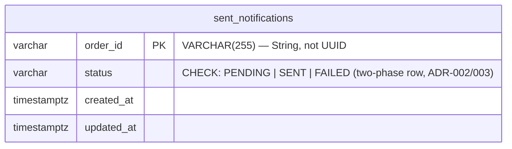

# Data Flow — EuroTransit 

This document describes **where data lives and how it moves** through the money path: the
per-service datastores, the exact event payloads on each Kafka topic, the synchronous HTTP
payloads, and what each service writes and reads at every step. Companion to
[control-flow.md](control-flow.md), which covers the *control* side (states, retries,
compensations).

> **Schema provenance.** Every schema below is taken from the **actual code**: the Flyway
> migrations under `backend/<service>/src/main/resources/db/migration/` (applied in order —
> the *effective* schema is the composition of all of them) cross-checked against the R2DBC
> entity classes. `eurotransit-config/scripts/seed-db.sh` is ops tooling, **not** a schema
> source: it happens to match today, but the migrations are the single source of truth.
> This matters for `orders`: V2 added seven columns (customer, route, pricing…) that were
> **never used by the entity and were dropped in V4**, and V3 replaced the `order_status`
> PostgreSQL ENUM with `VARCHAR(50)`. Anyone reading only V1 — or a seed script — gets the
> wrong schema.

## Data ownership at a glance

Database-per-service: no table is shared, and no service reads another service's database.
The only cross-service data reads are the synchronous `POST /payments/authorize` call
(ADR 0018) and Catalog's **startup-only** snapshot `GET /inventory/routes` (issue #31).
Everything else travels inside Kafka events — e.g. Notifications never calls back to Orders;
what it needs rides in the event.

| Service | Store | Contents |
|---|---|---|
| orders | `ordersdb` (PostgreSQL) | `orders`, `processed_events`, `idempotency_records` |
| inventory | `inventorydb` (PostgreSQL) | `routes`, `reservations`, `processed_events` |
| payments | `paymentsdb` (PostgreSQL) | `payment_intents`, `processed_events` *(legacy, unused — see below)* |
| notifications | `notificationsdb` (PostgreSQL) | `sent_notifications` |
| catalog | **none — in-memory only** | `RouteCache` (ConcurrentHashMap) + `seenReservations` set |

The authoritative seat count and the **price authority** live in Inventory: the order total is
computed there (`route.price × seats`) and travels downstream inside `inventory-reserved` —
Payments authorizes the amount it is handed, it never computes one.

## Data flow diagram

Cylinders are datastores, yellow pills are Kafka topics, red is failure/compensation data.
Solid arrows carry the payloads shown; dashed arrows are failure-path data.

## Kafka event payloads

Shapes taken from the producer's event classes; consumers declare mirror DTOs
(`spring.json.value.default.type`, JSON serialization).

| Topic | Producer class | Payload |
|---|---|---|
| `order-placed` | `orders/event/OrderEvents.kt` | `orderId: UUID`, `routeId: UUID`, `seats: Int`, `timestamp: Instant`, `idempotencyKey: String` |
| `inventory-reserved` | `inventory/event/InventoryEvents.kt` | `orderId: UUID`, `routeId: UUID`, `seats: Int`, `reservationId: UUID`, `amount: BigDecimal`, `timestamp: Instant` |
| `payment-authorized` | `payments/event/PaymentEvents.kt` | `orderId: UUID`, `paymentId: UUID`, `amount: BigDecimal`, `timestamp: Instant` |
| `order-confirmed` | `orders/event/OrderEvents.kt` | `orderId: UUID`, `timestamp: Instant` |
| `order-failed` | Orders & Inventory recoverers | `orderId: UUID`, `reason: String` (`"SOLD_OUT"` / exhaustion message), `timestamp: Instant` |
| `order-confirmed.DLT` | Notifications recoverer | the failed `order-confirmed` record, unchanged |

Contract subtleties, all encoded in the consumer DTOs:

- **`payment-authorized.amount` is nullable on the Orders consumer** — Jackson silently dropped
  the field before the audit fix (#19); nullable keeps pre-fix events deserializable.
- **Notifications reads `orderId` as `String`** (not UUID) and declares an optional
  `customerContact` defaulting to `customer@demo.eurotransit.test`: the Orders producer sends
  only `{orderId, timestamp}`. When the field was required, Jackson rejected every real event
  and the first live checkout went straight to the DLT.
- **`order-failed` carries only the orderId and reason** — deliberately no seat/route data:
  Inventory owns the reservation lookup, so the event cannot go stale.
- **Catalog dedups deliveries in memory** by `reservationId` (a `Set`, not a table) — enough
  within a pod's lifetime; a restart re-baselines via snapshot anyway (ADR 0006, #31).

## Synchronous HTTP payloads

| Call | Request | Response |
|---|---|---|
| `POST /orders` (SPA → Orders) | header `Idempotency-Key` (required), body `{routeId: UUID, seats: Int}` | `202 {orderId, status: "DRAFT", message}`; duplicate key → `200` cached body; over rate limit → `429` + `Retry-After: 1` (no body, nothing persisted) |
| `GET /orders/{id}` (SPA → Orders) | — | `200 {orderId, status, message: ""}` read from `orders`; `404` if unknown |
| `POST /payments/authorize` (Orders → Payments, ADR 0018) | header `Idempotency-Key` = orderId (validated against body), body `{orderId: UUID, amount: BigDecimal}` | `200 {paymentId, orderId, amount, status: "AUTHORIZED"}`; key/body mismatch → `400` |
| `GET /inventory/routes` (Catalog → Inventory, startup only) | — | JSON array of route rows; Catalog ignores unknown fields (e.g. `version`) |
| `GET /catalog`, `GET /catalog/{id}` (SPA → Catalog) | — | `CatalogRoute` list/item from the in-memory cache — **advisory** availability |

## Database schemas (from the Flyway migrations + entities)

### ordersdb — effective schema after V1 → V4

V1 created the tables with a PostgreSQL ENUM `order_status`; V3 converted `status` to
`VARCHAR(50)` and dropped the type; V2 added seven order-detail columns
(`customer_id`, `route_id`, `seat_class`, `quantity`, `total_amount`, `failure_reason`,
`version`) that the `Order` entity never had — four were `NOT NULL` without defaults, so every
INSERT would have failed — and **V4 dropped them all**. The entity enum has no `PAID` either
(removed with the synchronous authorize). What actually exists:

Indexes: `idx_orders_status`, `idx_orders_created_at`, `idx_processed_events_processed_at`.

### inventorydb

Partial index `idx_routes_available` on `available_seats > 0`. V2 seeds two deterministic demo
routes (`…0001` 100 seats, `…00ce` 2 seats) with `ON CONFLICT DO NOTHING` — the k6 and chaos
harnesses target them by fixed id.

### paymentsdb

**Legacy note:** `processed_events` and the `InventoryReservedEvent` DTO in
`payments/event/PaymentEvents.kt` are residue of the pre-ADR-0018 design, when Payments
consumed `inventory-reserved` from Kafka. The service has no `@KafkaListener` today; its
idempotency lives entirely in the two unique indexes on `payment_intents`.

### notificationsdb

`status` is `VARCHAR` + `CHECK`, not a PG ENUM, to avoid R2DBC enum-codec complexity. The
two-phase protocol: `claim()` inserts `PENDING` (insert-if-absent), the send happens, then
`UPDATE → SENT`. A redelivery finding `SENT`/`FAILED` is a no-op; finding `PENDING` retries
the send.

### Catalog — deliberately no database

`RouteCache` is a `ConcurrentHashMap<UUID, CatalogRoute>` (id, origin, destination,
departureTime, totalSeats, availableSeats, price) plus a `seenReservations` set. State is
disposable by design (AP/EL — ADR 0006): at startup it serves a hardcoded fallback seed
(mirroring inventory's V2 migration), hydrates **once** from `GET /inventory/routes` with
capped-backoff retries (replace-all, not merge — routes Inventory no longer knows must
disappear), then stays warm on `inventory-reserved` deltas with `auto.offset.reset=latest`.
Consequence for ops: a SQL reseed is invisible to Catalog until a restart
(`just catalog-refresh`).

## Data lifecycle of one order

| Step | Service | Writes | Reads |
|---|---|---|---|
| `POST /orders` | Orders | TX: `orders` row (DRAFT) + `idempotency_records` row (cached JSONB response) | `idempotency_records` (dedup check) |
| `order-placed` consumed | Inventory | TX: `routes.available_seats −= seats` (conditional, version-checked) + `reservations` row + `processed_events` | `processed_events`, `reservations` (existing?), `routes` (price, seats, version) |
| `inventory-reserved` consumed | Orders | `orders` DRAFT→RESERVED; `processed_events` **only after** successful authorize | `processed_events` |
| `inventory-reserved` consumed | Catalog | in-memory: advisory `availableSeats` decrement | `seenReservations` |
| `/payments/authorize` called | Payments | `payment_intents` row (or none, on replay) | `payment_intents` by `order_id` |
| `payment-authorized` consumed | Orders | TX: `orders` RESERVED→CONFIRMED + `processed_events` | `processed_events` |
| `order-confirmed` consumed | Notifications | `sent_notifications` claim PENDING, then → SENT | `sent_notifications` status |
| `order-failed` consumed | Orders | `orders` →FAILED (conditional) + `processed_events` | `processed_events` |
| `order-failed` consumed | Inventory | TX: `reservations` RESERVED→RELEASED + `routes.available_seats += seats` + `processed_events` | `processed_events`, `reservations` by `order_id` |

Two write-ordering invariants recur everywhere: **DB commit before Kafka publish**
(at-least-once safe — a crash between the two republishes, and consumers dedup) and, on the
payment step, **dedup record only after success** (so failed attempts are retried by
redelivery instead of being lost).

## Consistency model in data terms

The `order_id` is the logical join key across all four databases — there are **no physical
foreign keys across services**, only within `inventorydb`. Consistency is enforced per-store:
conditional state transitions in `orders`, the atomic seat UPDATE and
`UNIQUE(order_id, route_id)` in `inventorydb`, `UNIQUE(order_id)` in `paymentsdb`, and the
`sent_notifications` primary key. Inventory is the CP side (no oversell, ever); Catalog is the
AP side (browse never blocks, availability may lag). A declared bound: if Orders' recoverer
marks an order FAILED while a late `payment-authorized` lands, the order stays FAILED with an
`AUTHORIZED` intent in `paymentsdb` — the demo PSP never captures; a real one would need a
void/refund step.
